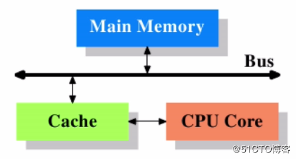
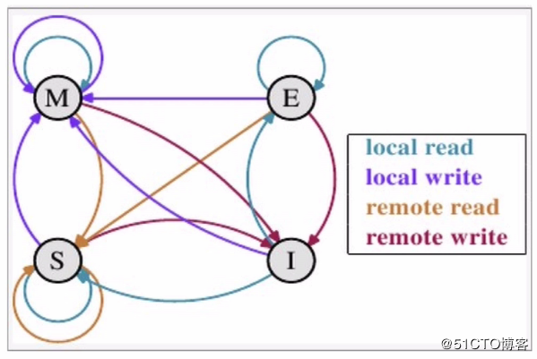
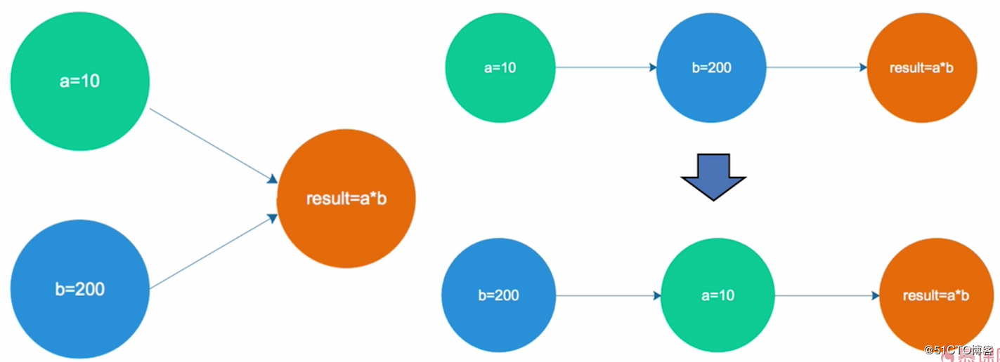
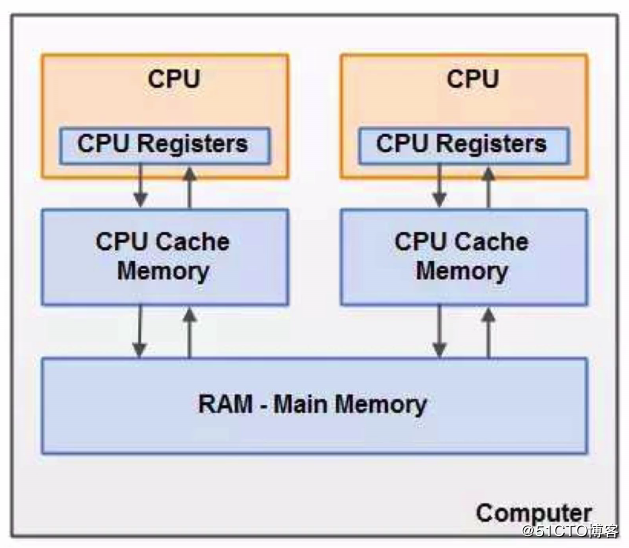
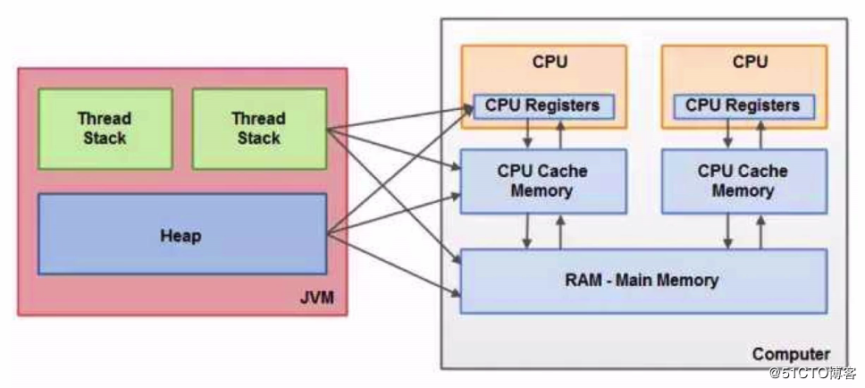

# 第1章 课程准备

> 参考博客 并发基础： https://blog.51cto.com/zero01/2094499

## 1.2 课程导学

### 1.2.1 高并发解决思路与手段

+ 扩容
+ 缓存
+ 队列
+ 拆分
+ 服务降级与熔断
+ 数据库切库
+ 分库分表等

### 1.2.2 课程的核心讲解与核心知识准备


### 1.2.3 并发编程的线程安全处理(第1~9章)


### 1.2.4 高并发处理的思路和手段(第10~17章)


## 1.3 并发编程初体验

> 代码见[Chapter01Start](src/main/java/com/huawei/l00379880/mythread/Chapter01Start)

### 1.3.1 计数器功能

[代码实现](src/main/java/com/huawei/l00379880/mythread/Chapter01Start/CountExample.java)

### 1.3.2 计数器的Map实现

[代码实现](src/main/java/com/huawei/l00379880/mythread/Chapter01Start/MapExample.java)

## 1.4 并发与高并发的基本概念

### 并发

> 同时拥有两个或者多个线程，如果程序在单核处理器上运行，多个线程将交替地换入或者换出内存，这些线程是同时"存在"地，每个线程都将处于执行过程中的某个状态，如果运行在多核处理器上，此时，程序中的每个线程都将分配到一个处理器核上，因此可以同时运行

### 高并发

> 高并发(High Concurrency)是互联网分布式系统结构设计中必须考虑的因素，它通常是指，通过设计保证系统能够`同时并行处理`很多请求

### 并发与高并发

+ 并发：多个线程操作相同的资源，保证线程安全，合理使用资源
+ 高并发：服务能同时处理很多请求，提高程序性能

### 课程涉及的技术栈


## 1.5 预备知识

### CPU多级缓存-缓存一致性

下图简单的展示了最简单的高速缓存的配置，数据的读取和存储都经过高速缓存，CPU核心与高速缓存有一条特殊的快速通道；主存与高速缓存都连在系统总线上（BUS）这条总线同时还用于其他组件的通信：



在高速缓存出现后不久，系统变得越来越复杂，高速缓存与主存之间的速度差异被拉大，直到加入了另一级缓存，新加入的这级缓存比第一缓存更大，但是更慢，而且经济上不合适，所以有了二级缓存，甚至有些系统已经拥有了三级缓存，于是就演变成了多级缓存，如下图：


### 为什么需要CPU cache?

> CPU的频率太快了，快到主存跟不上，这样在处理器时钟周期内，CPU常常需要等待主存，这样就会浪费资源。所以cache的出现，是为了缓解CPU和内存之间速度的不匹配问题（结构：CPU -> cache -> memory）


### 局部性原理

缓存的容量远远小于主存，因此出现缓存不命中的情况在所难免，既然缓存不能包含CPU所需要的所有数据，那么缓存的存在真的有意义吗？

CPU cache是肯定有它存在的意义的，至于CPU cache有什么意义，那就要看一下它的`局部性原理`了：

+ 1.时间局部性：如果某个数据被访问，那么在不久的将来它很可能再次被访问
+ 2.空间局部性：如果某个数据被访问，那么与它相邻的数据很快也可能被访问

### 多级缓存-缓存一致性(MESI) 详细阐述

MESI是一个协议，这协议用于保证多个CPU cache之间缓存共享数据的一致性。它定义了CacheLine的四种数据状态，而CPU对cache的四种操作可能会产生不一致的状态。因此缓存控制器监听到本地操作与远程操作的时候需要对地址一致的CacheLine状态做出一定的修改，从而保证数据在多个cache之间流转的一致性。CacheLine的四种状态如下：

+ `M`: Modified 修改，指的是该缓存行只被缓存在该CPU的缓存中，并且是被修改过的，因此他与主存中的数据是不一致的， 该缓存行中的数据需要在未来的某个时间点（允许其他CPU读取主存相应中的内容之前）写回主存，而当数据被写回主存之后，该缓存行的状态会变成E（独享）
+ `E`：Exclusive 独享 缓存行只被缓存在该CPU的缓存中，是未被修改过的，与主存的数据是一致的，可以在任何时刻当有其他CPU读取该内存时，变成S（共享）状态，同样的当CPU修改该缓存行的内容时，会变成M（被修改）的状态
+ `S`：Share 共享，当前CPU和其他CPU中都有共同数据，并且和主存中的数据一致；意味着该缓存行可能会被多个CPU进行缓存，并且各缓存中的数据与主存数据是一致的，当有一个CPU修改该缓存行时，在其他CPU中的该缓存行是可以被作废的，变成I(无效的) 状态
+ `I`：Invalid 无效的，代表这个缓存是无效的，可能是有其他CPU修改了该缓存行；数据应该从主存中获取，其他CPU中可能有数据也可能无数据，当前CPU中的数据和主存被认为是不一致的；对于invalid而言，在MESI协议中采取的是写失效（write invalidate）。



### CacheLine四种数据状态和16种状态转换

CacheLine有四种数据状态（MESI），而引起数据状态转换的CPU cache操作也有四种：

+ `local read`：读本地缓存中的数据
+ `local write`：将数据写到本地缓存里面
+ `remote read`：将内（主）存中的数据读取到缓存中来
+ `remote write`：将缓存中的数据写回到主存里面去

因此要完整的理解MESI这个协议，就需要把这16种状态转换的情况理解清楚，状态之间的相互转换关系，可以使用下图进行表示：


在一个典型的多核系统中，每一个核都会有自己的缓存来共享主存总线，每个相应的CPU会发出读写（I/O）请求，而缓存的目的是为了减少CPU读写共享主存的次数。一个缓存除了在 Invalid 状态之外，都可以满足CPU的读请求。

一个写请求只有在该缓存行是M状态，或者E状态的时候才能够被执行。如果当前状态是处在S状态的时候，它必须先将缓存中的该缓存行变成无效的（Invalid）状态，这个操作通常作用于广播的方式来完成。这个时候它既不允许不同的CPU同时修改同一个缓存行，即使修改该缓存行不同位置的数据也是不允许的，这里主要解决的是缓存一致性的问题。一个处于M状态的缓存行它必须时刻监听所有试图读该缓存行相对就主存的操作，这种操作必须在缓存将该缓存行写回主存并将状态变成S状态之前被延迟执行。

一个处于S状态的缓存行也必须监听其它缓存使该缓存行无效或者独享该缓存行的请求，并将该缓存行变成无效（Invalid）。

一个处于E状态的缓存行也必须监听其它缓存读主存中该缓存行的操作，一旦有这种操作，该缓存行需要变成S状态。

因此，对于M和E两种状态而言总是精确的，他们在和该缓存行的真正状态是一致的。而S状态可能是非一致的，如果一个缓存将处于S状态的缓存行作废了，而另一个缓存实际上可能已经独享了该缓存行，但是该缓存却不会将该缓存行升迁为E状态，这是因为其它缓存不会广播他们作废掉该缓存行的通知，同样由于缓存并没有保存该缓存行的copy的数量，因此（即使有这种通知）也没有办法确定自己是否已经独享了该缓存行。

从上面的意义看来E状态是一种投机性的优化：如果一个CPU想修改一个处于S状态的缓存行，总线事务需要将所有该缓存行的copy变成invalid状态，而修改E状态的缓存不需要使用总线事务。

### CPU多级缓存-乱序执行优化

什么是乱序执行优化：

处理器为提高运算速度而做出违背代码原有顺序的优化
例如，我现在有两个变量a和b，a的值为10，b的值为200，我要计算a乘以b的结果。而我在代码上写的是：

```java
a=10;
b=200;
result=a*b;
```

但是到了CPU上的乱序执行优化后，可能就变成了：

```java
b=200;
a=10;
result=a*b;
```

如下图：



从上图中，可以看到CPU乱序执行优化后的代码并不会对计算结果造成影响，但这也只是其中一种没被影响的情况而已。

在单核时代，处理器保证做出的优化不会导致执行结果远离预期目标。

但是在多核环境下则并非如此，因为在多核环境下同时会有多个核心在执行指令，每个核心的指令都可能被乱序。

另外处理器还引入了L1、L2等多级缓存机制，而每个核心都有自己的缓存，这就导致了逻辑次序上后写入的数据未必真的写入了。

如果我们不做任何防护措施，那么处理器最终处理的结果可能与我们代码的逻辑结果大不相同。比如我们在一个核心上执行数据写入操作，并在最后写一个标记用来表示之前的数据已经准备好了。然后从另外一个核心上通过判断这个标记来判定所需要的数据是否已准备就绪，这种做法就存在一定的风险，标记位可能先被写入，而数据并未准备完成，这个未完成既有可能是没有计算完成，也有可能是缓存没有被及时刷新到主存之中，这样最终就会导致另外的核心使用了错误的数据，所以我们才需要在多线程的情况下保证线程安全。

## 1.5 JAVA内存模型 Java Memory Model JMM

以上我们简单介绍了在多核并发的环境下CPU进行乱序执行优化时所带来的线程安全问题，为了保证线程安全，我们需要采取一些额外的手段去防止这种问题的发生。

不过在介绍如何采用实际手段解决这种问题之前，我们先来看看Java虚拟机是如何解决这种问题的：

> 为了屏蔽各种硬件和操作系统内存的访问差异，以实现让Java程序在各种平台下都能达到一致的并发效果，所以Java虚拟机规范中定义了Java内存模型(Java Memory Model简称JMM)

Java内存模型是一种规范，它定义了Java虚拟机与计算机内存是如何协同工作的。它规定了一个线程如何和何时可以看到由其他线程修改过后的共享变量的值，以及在必须时如何同步地访问共享变量。


### heap（堆）

> 运行时的数据区，是由垃圾回收负责,对象和创建和回收都在这里；

+ 优点：可以动态分配内存大小，生存期也不必事先告诉编译器，运行时动态分配内存，垃圾回收器会在不需要使用这些内存时，回收掉；
+ 缺点：因为时运行时动态分配内存，所以存储速度相对慢一些；

### stack（栈）

> 栈内存储基本类型变量，列入：小写的int，char......

+ 优点：存储速度比堆快，仅次于计算机的寄存器，栈的内存是可以共享的；
+ 缺点：存在栈内的数据大小与生存周期必须是确定的，缺乏灵活性，所以栈中主要用来存储一些基本数据类型的变量，比如：int，short，long，byte，double，float，boolean，char以及对象句柄等。


### 栈和堆的关系

Java内存模型要求调用栈和本地变量存放在线程栈（Thread Stack）上，而对象则存放在堆上。一个本地变量也可能是指向一个对象的引用，这种情况下这个保存对象引用的本地变量是存放在线程栈上的，但是对象本身则是存放在堆上的。

一个对象可能包含方法，而这些方法可能包含着本地变量，这些本地变量仍然是存放在线程栈上的。即使这些方法所属的对象是存放在堆上的。一个对象的成员变量，可能会随着所属对象而存放在堆上，不管这个成员变量是原始类型还是引用类型。静态成员变量则是随着类的定义一起存放在堆上。

存放在堆上的对象，可以被持有这个对象的引用的线程访问。当一个线程可以访问某个对象时，它也可以访问该对象的成员变量。如果两个线程同时调用同一个对象上的同一个方法，那么它们都将会访问这个方法中的成员变量，但是每一个线程都拥有这个成员变量的私有拷贝。

### 硬件内存架构

现代硬件内存模型与Java内存模型有一些不同。理解内存模型架构以及Java内存模型如何与它协同工作也是非常重要的。这部分描述了通用的硬件内存架构，下面的部分将会描述Java内存是如何与它“联手”工作的。

下图简单展示了现代计算机硬件内存架构：



+ `CPU`：一个现代计算机通常由两个或者多个CPU，其中一些CPU还有多个核心。从这一点可以看出，在一个有两个或者多个CPU的现代计算机上同时运行多个线程是可能的。每个CPU在某一时刻运行一个线程是没有问题的。这意味着，如果你的Java程序是多线程的，在你的Java程序中每个CPU上一个线程可能同时（并发）执行。
+ `CPU Registers(寄存器)`：每个CPU都包含一系列的寄存器，它们是CPU内内存的基础。CPU在寄存器上执行操作的速度远大于在主存上执行的速度。这是因为CPU访问寄存器的速度远大于主存。
+ `CPU Cache(高速缓存)`：由于计算机的存储设备与处理器的处理设备有着几个数量级的差距，所以现代计算机都会加入一层读写速度与处理器处理速度接近的高级缓存来作为内存与处理器之间的缓存。这就是CPU中的缓存层，实际上绝大多数的现代CPU都有一定大小的缓存层。因为CPU访问缓存层的速度快于访问主存的速度，所以可以将运算时使用到的数据复制到缓存中，让运算能够快速的执行，当运算结束后，再从缓存同步到内存之中，这样CPU就不需要等待缓慢的内存读写了。但通常访问缓存比访问内部寄存器的速度还要慢一点。而一些CPU还有多层缓存，但这些对理解Java内存模型如何和内存交互不是那么重要。只要知道CPU中可以有一个缓存层就可以了。
+ `主(内)存`：一个计算机还包含一个主存。所有的CPU都可以访问主存。主存通常比CPU中的缓存大得多。

运作原理：通常情况下，当一个CPU需要读取主存时，它会将主存的部分读到CPU缓存中。它甚至可能将缓存中的部分内容读到它的内部寄存器中，然后在寄存器中执行操作。当CPU需要将结果写回到主存中去时，它会将内部寄存器的值刷新到缓存中，然后在某个时间点将值刷新回主存。

当CPU需要在缓存层存放一些东西的时候，存放在缓存中的内容通常会被刷新回主存。CPU缓存可以在某一时刻将数据局部写到它的内存中，和在某一时刻局部刷新它的内存。它不会再某一时刻读/写整个缓存。通常，在一个被称作“cache lines”的更小的内存块中缓存被更新。一个或者多个缓存行可能被读到缓存，一个或者多个缓存行可能再被刷新回主存。

### Java内存模型和硬件内存架构之间的桥接

上面已经提到，Java内存模型与硬件内存架构之间存在差异。硬件内存架构没有区分线程栈和堆。对于硬件而言，所有的线程栈和堆都分布在主内存中。部分线程栈和堆可能有时候会出现在CPU缓存中和CPU内部的寄存器中。如下图所示：



### 线程和主内存的抽象关系

+ 线程A和线程B要进行通信必须要用主内存作为中转；
+ 每个线程并不能修改主内存中的共享变量，而只是有一份共享变量的副本


每个线程之间的共享变量存储在主内存里面，每个线程都有一个私有的本地内存，本地内存是Java内存模型的一个抽象的概念，并不是真实存在的。它涵盖了缓存、写缓存区、寄存器以及其他的硬件和编译器的优化，本地内存中存储了该线程已读或写共享变量的拷贝的一个副本。

从一个更低的层次来说，主内存就是硬件的内存，而为了获取更好的运行速度，虚拟机及硬件系统可能会让工作内存优先存储于寄存器和高速缓存中。

Java内存模型中的线程的工作内存（working memory）是cpu的寄存器和高速缓存的抽象描述。而JVM的静态内存存储模型（JVM内存模型）只是一种对内存的物理划分而已，它只局限在内存，而且只局限在JVM的内存。

如果上图中的线程A和线程B要通信，必须经历两个步骤：

首先线程A要把本地内存A中更新过的共享变量刷新到主内存里  

然后线程B再到主内存中去读取线程A更新的共享变量，这样就完成了两个线程之间的通信了
  
因此，多线程的环境下就会出现线程安全问题。例如我们要进行一个计数的操作：线程A在主内存中读取到了变量值为1，然后保存到本地内存A中进行累加。就在此时线程B并没有等待线程A把累加后的结果写入到主内存中再进行读取，而是在主内存中直接读取到了变量值为1，然后保存到本地内存B中进行累加。此时，两个线程之间的数据是不可见的，当两个线程同时把计算后的结果都写入到主内存中，就导致了计算结果是错误的。这种情况下，我们就需要采取一些同步的手段，确保在并发环境下，程序处理结果的准确性。


### 同步操作与规则


> 这里的工作内存就是上面图中的本地内存

+ 4对8种同步操作
  + 锁
    + `lock` (锁定):作用于主内存的变量,把一个变量标识为一条线程独占状态
    + `unlock` (解锁):作用于主内存的变量,把一个处于锁定状态的变量释放出来,释放后的变量才可以被其他线程锁定
  + 读写 
    + `read` (读取):作用于主内存的变量,把一个变量值从主内存传输到线程的工作内存中,以便随后的load动作使用write的操作 
    + `write` (写入):作用于主内存的变量,它把store操作从工作内存中一个变量的值传送到主内存的变量中
  + 加载与存储
    + `load` (载入):作用于工作内存的变量,它把read操作从主内存中得到的变量值放入工作内存的变量副本中
    + `store` (存储):作用于工作内存的变量,把工作内存中的一个变量的值传送到主内存中,以便随后的write操作
  + 值操作
    + `use` (使用):作用于工作内存的变量,把工作内存中的一个变量值传递给执行引擎
    + `assign` (赋值):作用于工作内存的变量,它把一个从执行引擎接收到的值赋值给工作内存的变量
    
+ 9个同步规则
  + 如果要把一个变量从主内存中复制到工作内存,就需要按顺寻地执行read和load操作,如果把变量从工作内存中同步回主内存中，就要按顺序地执行store和write操作。但Java内存模型只要求上述操作必须按顺序执行，而没有要求必须是连续执行
  + 不允许read和load 、store和write操作之一单独出现
  + 不允许一个线程丢弃它最近的assign的操作，即变量在工作内存中改变了之后必须同步到主内存中 
  + 不允许一个线程无原因地(没有发生过任何assign操作)把数据从工作内存同步回主内存中
  + 一个新的变量只能在主内存中诞生，不允许在工作内存中直接使用一个未被初始化(load或assign)的变量。即对一个变量实施use和store操作之前，必须先执行过了assign和load操作
  + 一个变量在同一时刻只允许一条线程对其进行lock操作，但lock操作可以被同一条线程重复执行多次，多次执行lock后，只有执行相同次数的unlock操作，变量才会被解锁。lock和unlock必须成对出现
  + 如果对一个变量执行lock操作，将清空工作内存中此变量的值，在执行引擎中使用这个变量前需要重新执行load或者assign操作来初始化变量的值
  + 如果一个变量实现没有被lock操作锁定，则不允许对它执行unlock操作；也不允许去unlock一个被其他线程锁定的变量
  + 对一个变量执行unlock操作之前，必须先把此变量同步到主内存中(执行store和write操作)
  
## 1.6 并发编程的优势与风险


