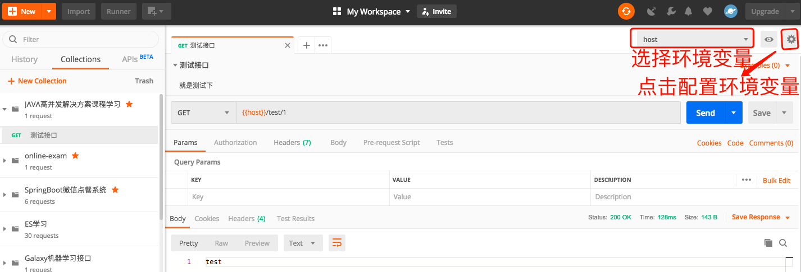
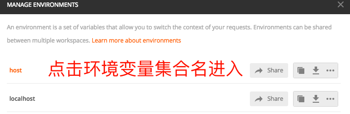
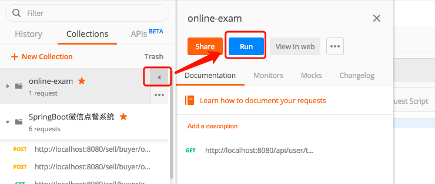
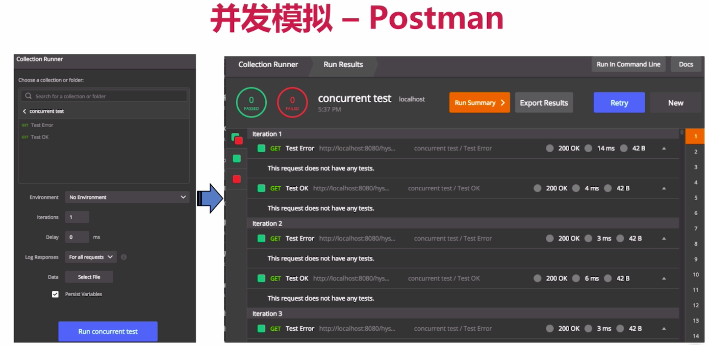

# 第02章 准备工作

## 2.1 初始化SpringBoot项目

> 略

## 2.2 准备注解和工具类

### 创建工具注解

+ Target:注解作用目标
+ Retention：注解作用范围

例子如下：

```java
// 作用目标
@Target(ElementType.TYPE)
// 注解存在范围
@Retention(RetentionPolicy.SOURCE)
public @interface ThreadNotRecommend {
    String value() default "";
}
```

所有的注解工作类见[annotations](src/main/java/com/huawei/l00379880/mythread/annotations)

## 2.3 并发模拟工具

+ Postman可以做Http请求模拟工具
+ Apache Bench(AB):Apache附带的工具,测试网站性能
+ JMeter是apache组织开发的压力测试工具，能很好的做并发模拟，并通过图表查看测试结果
+ 也可以使用代码模拟，Semaphore控制线程并发数，CountDownLatch控制线程执行流程

### postman并发测试

+ 设置环境变量
  > 
  > 
  > 
+ postman调出并发测试页面
  > 

+ postman并发模拟
  > 
  
### Apache Bench

> 简称ab,[下载地址](https://www.apachelounge.com/download)

[参考的博客](https://www.jianshu.com/p/a6549c7f055b)

#### 命令参数

+ `-n` requests Number of requests to perform  //本次测试发起的总请求数
+ `-c` concurrency Number of multiple requests to make //一次产生的请求数（或并发数）
+ `-t` timelimit Seconds to max. wait for responses　//测试所进行的最大秒数，默认没有时间限制。
+ `-r` Don't exit on socket receive errors. // 抛出异常继续执行测试任务 
+ `-p` postfile File containing data to POST //包含了需要POST的数据的文件，文件格式如“p1=1&p2=2”.使用方法是 -p 111.txt
+ `-T` content-type Content-type header for POSTing //POST数据所使用的Content-type头信息，如 -T “application/x-www-form-urlencoded” 。 （配合-p）
+ `-v` verbosity How much troubleshooting info to print //设置显示信息的详细程度 – 4或更大值会显示头信息， 3或更大值可以显示响应代码(404, 200等), 2或更大值可以显示警告和其他信息。 -V 显示版本号并退出。
+ `-C` attribute Add cookie, eg. -C “c1=1234,c2=2,c3=3” (repeatable) //-C cookie-name=value 对请求附加一个Cookie:行。 其典型形式是name=value的一个参数对。此参数可以重复，用逗号分割。
  > 提示：可以借助session实现原理传递 JSESSIONID参数， 实现保持会话的功能，如-C ” c1=1234,c2=2,c3=3, JSESSIONID=FF056CD16DA9D71CB131C1D56F0319F8″ 。
+ `-w` Print out results in HTML tables　　//以HTML表的格式输出结果。默认时，它是白色背景的两列宽度的一张表。


总体体验下来，具有轻量化特点的bench还是很适合中小企业使用，尤其在于模拟访问页面的多机测试。最后，希望更多行业大牛可以多多给我指教和交流，助我一起成长。读更多的好书，拍更美的照片，写更酷的代码，遇见更有趣的人，愿望是实现从IT菜鸟到全栈工程师的蜕变。


#### 使用举例

```shell
# n:测试总数, c:并发数
home/: ab -n 1000 -c 50 http://localhost:9999/test/1
This is ApacheBench, Version 2.3 <$Revision: 1843412 $>
Copyright 1996 Adam Twiss, Zeus Technology Ltd, http://www.zeustech.net/
Licensed to The Apache Software Foundation, http://www.apache.org/

Benchmarking localhost (be patient)
Completed 100 requests
Completed 200 requests
Completed 300 requests
Completed 400 requests
Completed 500 requests
Completed 600 requests
Completed 700 requests
Completed 800 requests
Completed 900 requests
Completed 1000 requests
Finished 1000 requests


Server Software:        
Server Hostname:        localhost
Server Port:            9999

Document Path:          /test/1
Document Length:        4 bytes

Concurrency Level:    50 # 并发量
Time taken for tests: 1.480 seconds # 整个测试所用的时间
Complete requests:    1000 # 完成的请求数
Failed requests:      0 # 失败的请求数
Total transferred:    136000 bytes # 所有请求的响应数据长度总和，包括每个HTTP响应数据的头信息和正文数据的长度 
HTML transferred:     4000 bytes # 所有请求的响应数据中正文数据的总和，也就是减去了Total transferred中HTTP响应数据中的头信息的长度
Requests per second:  675.85 [#/sec] (mean) # 吞吐率。吞吐率是和并发数相关地，即使请求总数相同，但如果并发数不同，
                                            # 吞吐率还是很可能有很大差异地, 计算公式：Complete requests/Time taken for tests
Time per request:     73.981[ms](mean) # 用户平均请求等待时间，也就是一次并发总的时间
Time per request:     1.480[ms](mean, across all concurrent requests) # 服务器平均请求等待时间，也就是一次请求所需时间
                                                                      # 计算公式：Time taken for tests/Complete requests;
                                                                      # 也可以这么统计：Time per request/Concurrency Level 
Transfer rate:          89.76 [Kbytes/sec] received # 这些请求在单位时间内从服务器获取的数据长度
                                                    # 计算公式：Total trnasferred/ Time taken for tests
                                                    # 这个统计很好的说明服务器的处理能力达到极限时，其出口宽带的需求量
Connection Times (ms)
              min  mean[+/-sd] median   max
Connect:        0    1   0.6      1       3
Processing:     5   71  53.5     70     446
Waiting:        2   43  30.4     42     400
Total:          5   72  53.5     70     446

Percentage of the requests served within a certain time (ms)
# 这部分数据用于描述每个请求处理时间的分布情况，比如以上测试，80%的请求处理时间都不超过6ms，
# 这个处理时间是指前面的Time per request，即对于单个用户而言，平均每个请求的处理时间。
  50%     70
  66%     75
  75%     77
  80%     79
  90%     92
  95%    145
  98%    275
  99%    331
 100%    446 (longest request)
```

### JMeter

> 下载地址：https://www.newasp.net/soft/393753.html

使用教程参考[JMeter性能测试，完整入门篇](https://blog.csdn.net/lovesoo/article/details/78579547)

## 2.4 代码模拟并发, CountDownLatch、CyclicBarrier和Semaphore  

参考博客：
+ [CountDownLatch、CyclicBarrier、Semaphore 用法总结](https://segmentfault.com/a/1190000012234469)
+ [CountDownLatch、CyclicBarrier、Semaphore共同之处与区别以及各自使用场景](https://blog.csdn.net/jackyechina/article/details/52931453)
+ [Java计数器之CountDownLatch、CyclicBarrier、Semaphore](https://www.cnblogs.com/xing901022/p/8696550.html)

### 2.4.1 CountDownLatch

> CountDownLatch 类位于 java.util.concurrent 包下，利用它可以实现类似计数器的功能。比如有一个任务A，它要等待其他4个任务执行完毕之后才能执行，此时就可以利用CountDownLatch来实现这种功能了


#### 构造器

CountDownLatch类只提供了一个构造器：

```java
public CountDownLatch(int count) { }; //参数count为计数值
```

#### 常用方法

然后下面这3个方法是CountDownLatch类中最重要的方法：

+ `void await()`:调用await()方法的线程会被挂起，它会等待直到count值为0才继续执行
+ `boolean await(long timeout, TimeUnit unit)`: 和await()类似，只不过等待一定的时间后count值还没变为0的话就会继续执行
+ `void countDown()`: 将count值减1

#### 代码示例

[CountDownLatchTest](src/main/java/com/huawei/l00379880/mythread/Chapter02Prepare/CountDownLatchTest.java)

### 2.4.2 CyclicBarrier

> 字面意思回环栅栏，通过它可以实现`让一组线程等待至某个状态之后再全部同时执行`。`叫做回环是因为当所有等待线程都被释放以后，CyclicBarrier可以被重用`。我们暂且把这个状态就叫做barrier，当调用await()方法之后，线程就处于barrier了。

#### 构造器

CyclicBarrier类位于java.util.concurrent包下，CyclicBarrier提供2个构造器：


+ `CyclicBarrier(int parties, Runnable barrierAction)`
+ `CyclicBarrier(int parties)`

参数说明

+ 参数parties指让多少个线程或者任务等待至barrier状态
+ 参数barrierAction为当这些线程都达到barrier状态时会执行的内容

#### 重要的方法

> CyclicBarrier中最重要的方法就是 await 方法，它有2个重载版本：

+ `int await()`:比较常用，用来挂起当前线程，直至所有线程都到达barrier状态再同时执行后续任务
+ `int await(long timeout, TimeUnit unit)`:让这些线程等待至一定的时间，如果还有线程没有到达barrier状态就直接让到达barrier的线程执行后续任务

#### 代码测试

+ [用来挂起当前线程，直至所有线程都到达barrier状态再同时执行后续任务](src/main/java/com/huawei/l00379880/mythread/Chapter02Prepare/CyclicBarrierBasicTest.java)
+ [在所有线程写入操作完之后，进行额外的其他操作](src/main/java/com/huawei/l00379880/mythread/Chapter02Prepare/CyclicBarrierRunnableTest.java)
+ [CyclicBarrier是可以重用的](src/main/java/com/huawei/l00379880/mythread/Chapter02Prepare/CyclicBarrierReuseTest.java)


