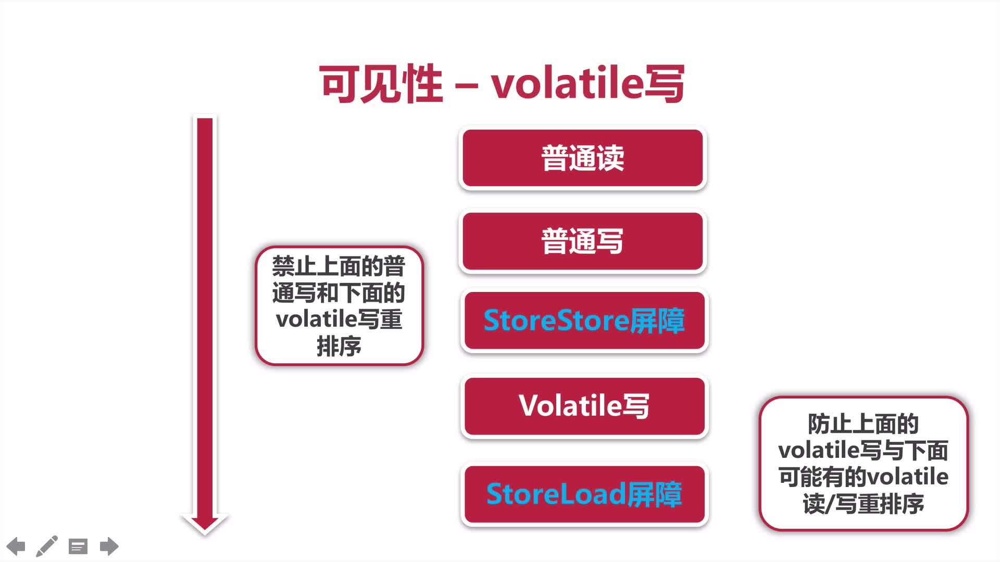
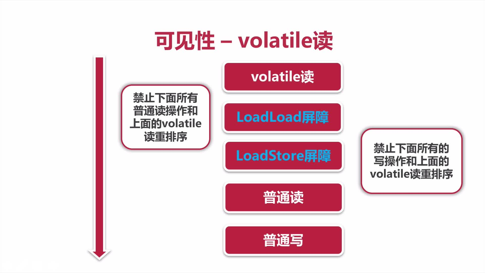

# 第03章 线程安全性

> 参考的博客：https://blog.51cto.com/zero01/2300671

## 3.0 线程安全性概述

> 当多个线程访问某个类时，不管运行时环境采用`何种调度方式`或者这些进程将如何交替执行，并且在主调代码中`不需要任何额外的同步或协同`，这个类都能表现出`正确的行为`，那么就称这个类是线程安全的

线程安全性主要体现在三个方面：

+ `原子性`：提供了互斥访问，同一时刻只能有一个线程来对它进行操作
+ `可见性`：一个线程对主内存的修改可以及时的被其他线程观察到
+ `有序性`：一个线程观察其他线程中的指令执行顺序，由于指令重排的存在，该观察结果一般杂乱无序

## 3.1~3.2 原子性 之 Atomic

### 原子包-Atomic包

说到原子性，就不得不提及JDK里的atomic包，该包中提供了很多Atomic的类，本小节主要介绍该包中常用的几个类。这些类都是通过CAS来实现原子性的，atomic包提供了如下具有原子性的类：

> java.util.concurrent.atomic.AtomicXXX

`AtomicXXX`: CAS、Unsafe.compareAndSwap(简称CAS)


### CAS

CAS （compareAndSwap），中文叫比较交换，一种无锁原子算法。过程是这样：它包含 3 个参数 CAS（V，E，N），V表示要更新变量的值Value，E表示预期值Expected，N表示新值New。仅当 V值等于E值时，才会将V的值设为N，如果V值和E值不同，那么说明已经有其他线程做了更新，当前线程则什么都不做。最后，CAS 返回当前V的真实值。CAS 操作时抱着乐观的态度进行的，它总是认为自己可以成功完成操作。

当多个线程同时使用CAS 操作一个变量时，只有一个会胜出，并成功更新，其余均会失败。失败的线程不会挂起，仅是被告知失败，并且允许再次尝试，当然也允许实现的线程放弃操作。基于这样的原理，CAS 操作即使没有锁，也可以发现其他线程对当前线程的干扰。

与锁相比，使用CAS会使程序看起来更加复杂一些，但`由于其非阻塞的，它对死锁问题天生免疫`，并且，线程间的相互影响也非常小。更为重要的是，使用无锁的方式完全没有锁竞争带来的系统开销，也没有线程间频繁调度带来的开销，因此，他要比基于锁的方式拥有更优越的性能。

简单的说，CAS 需要你额外给出一个期望值，也就是你认为这个变量现在应该是什么样子的。如果变量不是你想象的那样，哪说明它已经被别人修改过了。你就需要重新读取，再次尝试修改就好了。

### CAS的缺点：

CAS 看起来非常的吊，但是它仍然有缺点，最著名的就是 ABA 问题：在CAS操作的时候，其他线程将变量的值A改成了B，然后又改成了A。本线程使用期望值A与当前变量进行比较的时候，发现A变量没有变，于是CAS就将A值进行了交换操作。这个时候实际上A值已经被其他线程改变过，这与设计思想是不符合的。

如果只是在基本类型上是没有问题的，但如果是引用类型呢？这个对象中有多个变量，我怎么知道有没有被改过？聪明的你一定想到了，加个版本号啊。每次修改就检查版本号，如果版本号变了，说明改过。这样只要变量被某一个线程修改过，该变量版本号就会发生递增操作，从而解决了ABA问题

### CAS 底层原理：

CAS是如何将比较和交换这两个操作，变成一个原子操作呢？这归功于硬件指令集的发展，实际上，我们可以使用同步将这两个操作变成原子的，但是这么做就没有意义了。所以我们只能靠硬件来完成，硬件保证一个从语义上看起来需要多次操作的行为只通过一条处理器指令就能完成。这类指令常用的有：

+ 测试并设置(Test-and-Set)
+ 获取并增加(Fetch-and-Increment)
+ 交换(Swap)
+ 比较并交换（Compare-and-Swap）
+ 加载链接/条件存储（Load-Linked/Store-Conditional）

其中，前面的3条是20世纪时，大部分处理器已经有了，后面的2条是现代处理器新增的。而且这两条指令的目的和功能是类似的，在IA64，x86 指令集中有 cmpxchg 指令完成 CAS 功能，在 sparc-TSO 也有 casa 指令实现，而在 ARM 和 PowerPC 架构下，则需要使用一对 ldrex/strex 指令来完成 LL/SC 的功能。

CPU 实现原子指令有2种方式：

+ 通过总线锁定来保证原子性：
  > 总线锁定其实就是处理器使用了总线锁，所谓总线锁就是使用处理器提供的一个 LOCK# 信号，当一个处理器在总线上输出此信号时，其他处理器的请求将被阻塞住，那么该处理器可以独占共享内存。但是该方法成本太大。因此有了下面的方式。
+ 通过缓存锁定来保证原子性：
  > 所谓 缓存锁定 是指内存区域如果被缓存在处理器的缓存行中，并且在Lock 操作期间被锁定，那么当他执行锁操作写回到内存时，处理器不在总线上声言 LOCK# 信号，而是修改内部的内存地址，并允许他的缓存一致性机制来保证操作的原子性，因为缓存一致性机制会阻止同时修改两个以上处理器缓存的内存区域数据（这里和 volatile 的可见性原理相同），当其他处理器回写已被锁定的缓存行的数据时，会使缓存行无效。


注意：有两种情况下处理器不会使用缓存锁定：

+ 当操作的数据不能被缓存在处理器内部，或操作的数据跨多个缓存行时，则处理器会调用总线锁定。
+ 有些处理器不支持缓存锁定，对于 Intel 486 和 Pentium 处理器，就是锁定的内存区域在处理器的缓存行也会调用总线锁定。

### 举例1：AtomicInteger和Unsafe.weakCompareAndSetInt

```java
import lombok.extern.slf4j.Slf4j;

import java.util.concurrent.CountDownLatch;
import java.util.concurrent.ExecutorService;
import java.util.concurrent.Executors;
import java.util.concurrent.Semaphore;

/**
 * @program: concurrency-demo
 * @description: 模拟并发请求
 * @author: 01
 * @create: 2019-08-29 07:55
 **/
@Slf4j
public class CountExample1 {

    /**
     * 请求总数
     */
    public static int clientTotal = 5000;

    /**
     * 同时并发执行的线程数量
     */
    public static int threadTotal = 200;

    /**
     * 计数
     */
    private static int count = 0;

    public static void main(String[] args) throws InterruptedException {
        ExecutorService executorService = Executors.newCachedThreadPool();
        Semaphore semaphore = new Semaphore(threadTotal);
        CountDownLatch countDownLatch = new CountDownLatch(clientTotal);
        for (int i = 0; i < clientTotal; i++) {
            executorService.execute(() -> {
                try {
                    // 从信号量获取执行许可，若并发达到设定的数量，那么就不会获取到许可，将会阻塞当前线程，直到能够获取到执行许可为止
                    semaphore.acquire();
                    CountExample1.add();
                    // 释放当前线程
                    semaphore.release();
                } catch (InterruptedException e) {
                    log.error("", e);
                }
                countDownLatch.countDown();
            });
        }

        countDownLatch.await();
        executorService.shutdown();
        log.info("count: {}", count);
    }

    private static void add() {
        count++;
    }
}
```

以上这个例子，每次执行输出的结果是不确定的，这种就是线程不安全的。如果我们将以上例子中的count类型换成 AtomicInteger，让这个变量具有原子性的话，就能够保证线程安全了。修改代码如下（重复代码忽略）：

```java
...
import java.util.concurrent.atomic.AtomicInteger;

@Slf4j
public class CountExample2 {
    ...

    /**
     * 计数
     */
    private static AtomicInteger count = new AtomicInteger(0);

    public static void main(String[] args) throws InterruptedException {
        ...

        countDownLatch.await();
        executorService.shutdown();
        log.info("count: {}", count.get());
    }

    private static void add() {
        // 先+1，然后获取当前的值，类似于++count
        count.incrementAndGet();
    }
}
```

将count变量的类型修改成 AtomicInteger 后，每次执行输出的结果都会是5000，这样就具有了线程安全性。那么这是怎么做到的呢？我们可以看一下incrementAndGet方法的源码：

```java
/**
 * Atomically increments by one the current value.
 *
 * @return the updated value
 */
public final int incrementAndGet() {
    return unsafe.getAndAddInt(this, valueOffset, 1) + 1;
}
```

可以看到，在这个方法里实际是通过U这个对象调用了getAndAddInt方法，往该方法里传入了当前对象以及当前对象的值偏移量和增量值1。而这个U是什么呢？实际上是Unsafe这个类的实例（我这里使用的是JDK11，其他JDK版本的源码可能不太一样，但是都一样是都是指向Unsafe的实例）：

```java
/**
 * Atomically adds the given value to the current value of a field
 * or array element within the given object {@code o}
 * at the given {@code offset}.
 *
 * @param o object/array to update the field/element in
 * @param offset field/element offset
 * @param delta the value to add
 * @return the previous value
 * @since 1.8
 */
@HotSpotIntrinsicCandidate
public final int getAndAddInt(Object o, long offset, int delta) {
    int v;
    do {
        v = getIntVolatile(o, offset);
    } while (!weakCompareAndSetInt(o, offset, v, v + delta));
    return v;
}
```

这个方法里主要就是一个do while语句，在while里面调用了一个weakCompareAndSetInt方法：

```java
@HotSpotIntrinsicCandidate
public final boolean weakCompareAndSetInt(Object o, long offset, int expected,int x) {
    return compareAndSetInt(o, offset, expected, x);
}
```

而weakCompareAndSetInt方法里又调用了一个compareAndSetInt方法，这个方法较为核心，而且是使用 native 标识的，代表这是使用其他语言实现的底层方法，例如C/C++：

```java
/**
 * Atomically updates Java variable to {@code x} if it is currently
 * holding {@code expected}.
 *
 * <p>This operation has memory semantics of a {@code volatile} read
 * and write.  Corresponds to C11 atomic_compare_exchange_strong.
 *
 * @return {@code true} if successful
 */
@HotSpotIntrinsicCandidate
public final native boolean compareAndSetInt(Object o, long offset, int expected, int x);
```

我们再回过头来看getAndAddInt方法，简单解释一下这个方法做的事情及其参数的含义，然后再看它们的调用关系就能清楚了：

```java
/**
 * o 是需要操作的 AtomicInteger 对象
 * offset 是AtomicInteger里value的地址偏移量
 * delta 需要增加的值，即增量值
 */
public final int getAndAddInt(Object o, long offset, int delta) {
    int v;
    do {
        // 获取当前主内存里最新的期望值
        v = getIntVolatile(o, offset);

        // 如果当前o内的value值和期望值v相等，就证明没有其他线程改变过这个变量，
        // 那么就更新它为期望值v + 增量值delta，否则失败返回false。如果这一步CAS没有成功，
        // 那就采用无锁自旋的方式继续进行CAS操作。这块是一条CPU指令完成的，依旧是原子操作
    } while (!weakCompareAndSetInt(o, offset, v, v + delta));
    return v;
}
```

### 举例2：AtomicLong和LongAdder

在之前的例子中，我们可以看到AtomicInteger在执行CAS操作的时候，是用死循环的方式，如果线程竞争非常激烈，那么失败量就会很高，性能也就会受到影响。而AtomicLong也是一样的，它们调用的都是Unsafe里面的方法，只不过是方法参数类型不一样而已，实现思想是一样的。既然有了AtomicLong为什么还需要LongAdder呢？自然是因为LongAdder有区别于AtomicLong的优点。

我们都知道，JVM会将long，double这些64位的变量的读写操作拆分成两个32位的操作，而LongAdder的设计思想也类似于此。LongAdder的设计思想：

> 核心是将热点数据分离，可以将AtomicLong的内部数据value分成一个数组，每个线程访问时，通过hash等算法映射到其中一个数字进行计数，而最终计数结果为这个数组的求和累加。其中热点数据value会被分离成多个单元的cell，每个cell独自维护内部的值，当前对象内value的实际值由所有的cell累积合成，从而使热点进行了有效的分离，提高了并行度。这样一来 LongAdder 相当于是在AtomicLong的基础上将单点的更新压力分散到各个节点上，在低并发的时候通过对base的直接更新，可以很好的保证和Atomic的性能基本一致，在高并发的场景，通过将热点分散来提高并行度
  
缺点：在统计的时候如果有并发更新，可能会导致统计结果有些误差。

代码示例:

+ [AtomicLong使用举例](src/main/java/com/huawei/l00379880/mythread/Chapter03Security/Section1Atomic1/CountExampleAtomicLong.java)
+ [LongAdder使用举例](src/main/java/com/huawei/l00379880/mythread/Chapter03Security/Section1Atomic1/CountExampleAtomicLongAdder.java)

`LongAdder.increment()`源码

```java
/**
 * Equivalent to {@code add(1)}.
 */
public void increment() {
    add(1L);
}
```

`LongAdder.add(long x)`源码

```java
/**
 * Adds the given value.
 *
 * @param x the value to add
 */
public void add(long x) {
    Cell[] as; long b, v; int m; Cell a;
    if ((as = cells) != null || !casBase(b = base, b + x)) {
        boolean uncontended = true;
        if (as == null || (m = as.length - 1) < 0 ||
            (a = as[getProbe() & m]) == null ||
            !(uncontended = a.cas(v = a.value, v + x)))
            longAccumulate(x, null, uncontended);
    }
}
```

### 举例3：AtomicReference和AtomicReferenceFieldUpdater

AtomicReference和AtomicInteger非常类似，不同之处就在于AtomicInteger是对整数的封装，而AtomicReference是对对象引用的封装，AtomicReference用于保证对象引用的原子性。AtomicReference的用法同AtomicInteger一样，只不过是可以放各种对象。AtomicReference的使用示例如下：

```java
@Slf4j
public class AtomicExample4 {

    private static AtomicReference<Integer> count = new AtomicReference<>(0);

    public static void main(String[] args) {
        // 期望值为0时，更新为2
        count.compareAndSet(0, 2);  // 更新为2
        // 期望值为0时，更新为1
        count.compareAndSet(0, 1);  // 不会执行
        // 期望值为1时，更新为3
        count.compareAndSet(1, 3);  // 不会执行
        // 期望值为2时，更新为4
        count.compareAndSet(2, 4);  // 更新为4
        // 期望值为3时，更新为5
        count.compareAndSet(3, 5);  // 不会执行

        // 输出结果为4
        log.info("count:{}", count.get());
    }
}
```

AtomicReferenceFieldUpdater有基本类型的实现，例如AtomicIntegerFieldUpdater ，它们的核心作用是可以原子性的去更新某一个类的实例里所指定的某一个字段。AtomicReferenceFieldUpdater可以`原子性的更新对象类型的字段`，而AtomicIntegerFieldUpdater 则只可以更新整型字段。如下示例：

```java
@Slf4j
public class AtomicExample5 {

    /**
     * 所指定的字段必须是使用volatile关键字修饰的，并且是非static的
     */
    @Getter
    public volatile int count = 100;

    /**
     * 指定原子性地更新AtomicExample5实例里的count字段。第一个参数为类的class，第二个参数为指定的字段名称
     */
    private static final AtomicIntegerFieldUpdater<AtomicExample5> UPDATER = AtomicIntegerFieldUpdater.newUpdater(AtomicExample5.class, "count");

    public static void main(String[] args) {
        AtomicExample5 example5 = new AtomicExample5();

        // 期望值为100时，更新为120，更新成功返回true，否则返回false
        if (UPDATER.compareAndSet(example5, 100, 120)) {
            log.info("update success 1, {}", example5.getCount());
        }

        // 此时count=120，所以更新失败返回false
        if (UPDATER.compareAndSet(example5, 100, 120)) {
            log.info("update success 2, {}", example5.getCount());
        } else {
            log.info("update failed, {}", example5.getCount());
        }
    }
}
```

### 举例4：AtomicStampReference

在上文中，我们提到了CAS里关于ABA的问题，AtomicStampReference类的主要作用就是用于解决CAS里的ABA问题，该类的方法加上了stamp（戳记）进比较，这个stamp是自行定义的，常见的有使用时间戳等。AtomicStampReference里的核心方法源码：

```java
/**
 * Atomically sets the value of both the reference and stamp
 * to the given update values if the
 * current reference is {@code ==} to the expected reference
 * and the current stamp is equal to the expected stamp.
 *
 * @param expectedReference the expected value of the reference
 * @param newReference the new value for the reference
 * @param expectedStamp the expected value of the stamp
 * @param newStamp the new value for the stamp
 * @return {@code true} if successful
 */
public boolean compareAndSet(V   expectedReference,
                             V   newReference,
                             int expectedStamp,
                             int newStamp) {
    Pair<V> current = pair;
    return
        expectedReference == current.reference &&
        expectedStamp == current.stamp &&
        ((newReference == current.reference &&
          newStamp == current.stamp) ||
         casPair(current, Pair.of(newReference, newStamp)));
}
```

### 举例5：AtomicLongArray

AtomicLongArray主要作用是可以原子性的更新一个数组里指定索引位置的值，所以AtomicLongArray里的方法都会需要传入一个索引值，例如compareAndSet方法需要传一个index，源码如下：

```java
/**
 * Atomically sets the element at index {@code i} to {@code newValue}
 * if the element's current value {@code == expectedValue},
 * with memory effects as specified by {@link VarHandle#compareAndSet}.
 *
 * @param i the index
 * @param expectedValue the expected value
 * @param newValue the new value
 * @return {@code true} if successful. False return indicates that
 * the actual value was not equal to the expected value.
 */
public final boolean compareAndSet(int i, long expectedValue, long newValue) {
    return AA.compareAndSet(array, i, expectedValue, newValue);
}
```

### 举例6：AtomicBoolean(平时用的比较多)

经过之前的铺垫，就已经知道AtomicBoolean可以原子性的操作boolean值。举一个例子，我们可以利用AtomicBoolean.compareAndSet方法来实现控制某一段代码只会执行一次。示例代码如下：

```java
@Slf4j
public class AtomicExample6 {
    /**
     * 执行总数
     */
    public static int execTotal = 5000;

    private static AtomicBoolean isHappened = new AtomicBoolean(false);

    public static void main(String[] args) throws Exception {
        ExecutorService executorService = Executors.newCachedThreadPool();
        for (int i = 0; i < execTotal; i++) {
            executorService.execute(AtomicExample6::test);
        }

        executorService.shutdown();
        log.info("isHappened: {}", isHappened.get());
    }

    private static void test() {
        // 只会打印一次日志
        if (isHappened.compareAndSet(false, true)) {
            log.info("execute");
        }
    }
}
```

AtomicBoolean.compareAndSet方法源码如下：

```java
/**
 * Atomically sets the value to {@code newValue}
 * if the current value {@code == expectedValue},
 * with memory effects as specified by {@link VarHandle#compareAndSet}.
 *
 * @param expectedValue the expected value
 * @param newValue the new value
 * @return {@code true} if successful. False return indicates that
 * the actual value was not equal to the expected value.
 */
public final boolean compareAndSet(boolean expectedValue, boolean newValue) {
    return VALUE.compareAndSet(this,
                               (expectedValue ? 1 : 0),
                               (newValue ? 1 : 0));
}
```

## 3.3 原子性 之 synchronized

我们知道原子性提供了互斥访问，同一时刻只能有一个线程来对它进行操作。在Java里能保证同一时刻只有一个线程来对其进行操作的，除了atomic包之外，还有锁机制。

JDK提供的锁主要分两种：

+ synchronized：依赖JVM （主要依赖JVM实现锁，因此在这个关键字作用对象的作用范围内，都是同一时刻只能有一个线程可以进行操作的）
+ Lock：代码层面的锁，依赖特殊的CPU指令，通过代码实现。Lock是一个接口，常用的实现类是ReentrantLock

synchronized是Java中的一个关键字，它是一种同步锁，其修饰的内容有如下四种：

+ 修饰代码块：被修饰的代码称之为同步语句块，作用的范围是大括号括起来的代码，作用于调用这个代码块的对象
+ 修饰方法：被修饰的方法称之为同步方法，作用的范围是整个方法，作用于调用这个方法的对象
+ 修饰静态方法：作用的范围是整个静态方法，作用于这个类的所有对象
+ 修饰类：作用的范围是大括号括起来的部分，作用于这个类的所有对象

实现原子性方式的对比：

+ synchronized：不可中断锁，适合竞争不激烈，可读性好
+ Lock：可中断锁，能多样化同步，竞争激烈时能维持常态
+ Atomic：竞争激烈时能维持常态，比Lock性能好，但只能同步一个值

接下来我们通过一个例子简单演示一下使用synchronized修饰代码块和修饰方法：

```java
@Slf4j
public class SynchronizedExample1 {

    /**
     * 修饰一个代码块
     */
    public void test1() {
        synchronized (this) {
            for (int i = 0; i < 10; i++) {
                log.info("test1 - {}", i);
            }
        }
    }

    /**
     * 修饰一个方法
     * 若子类继承父类，想调用父类的synchronized方法的话，是带不上synchronized关键字的
     * 原因：synchronized 不属于方法声明的一部分
     * 如果子类也想使用同步需要在方法上声明
     */
    public synchronized void test2() {
        for (int i = 0; i < 10; i++) {
            log.info("test2 - {}", i);
        }
    }

    public static void main(String[] args) {
        SynchronizedExample1 example1 = new SynchronizedExample1();
        SynchronizedExample1 example2 = new SynchronizedExample1();

        // 使用线程池模拟多线程同时调用同一段sync代码
        ExecutorService executorService = Executors.newCachedThreadPool();

        // 由于同步块的作用，所以线程pool-1-thread-1 先输出0-9，然后pool-1-thread-2 再输出0-9
        executorService.execute(example1::test1);
        executorService.execute(example1::test1);

        // 由于同步方法只作用于调用该方法的对象，而这里分别使用了不同对象进行调用
        // 所以这里线程 pool-1-thread-1和pool-1-thread-2 是交叉输出的
        executorService.execute(example1::test2);
        executorService.execute(example2::test2);

        executorService.shutdown();
    }
}
```

然后我们再来看看使用synchronized修饰静态方法和修饰类的例子：

```java
@Slf4j
public class SynchronizedExample2 {

    /**
     * 修饰类
     */
    public void test1() {
        synchronized (SynchronizedExample2.class) {
            for (int i = 0; i < 10; i++) {
                log.info("test1 - {}", i);
            }
        }
    }

    /**
     * 修饰一个静态方法
     */
    public static synchronized void test2() {
        for (int i = 0; i < 10; i++) {
            log.info("test2 - {}", i);
        }
    }

    public static void main(String[] args) {
        SynchronizedExample2 example1 = new SynchronizedExample2();
        SynchronizedExample2 example2 = new SynchronizedExample2();

        // 使用线程池模拟多线程同时调用同一段sync代码
        ExecutorService executorService = Executors.newCachedThreadPool();

        // 由于同步块的作用，所以线程pool-1-thread-1 先输出0-9，然后pool-1-thread-2 再输出0-9
        executorService.execute(example1::test1);
        executorService.execute(example1::test1);

        // 由于静态同步方法作用于该类的所有对象，所以即便这里分别使用了不同对象进行调用也是同步的
        executorService.execute(() -> example1.test2());
        executorService.execute(() -> example2.test2());

        executorService.shutdown();
    }
}
```

注：由于Lock涵盖的东西比较多，到时候会放到另外一篇文章中介绍，这里就先略过

## 3.4 线程安全性-可见性

本小节我们来简单介绍一下线程安全性里的可见性，可见性是让一个线程对主内存的修改可以及时的被其他线程观察到。

与可见性相反的就是不可见性，导致共享变量在线程中不可见的一些主要原因：

+ 线程交叉执行
+ 重排序结合线程交叉执行
+ 共享变量更新后的值没有在工作内存与主内存间及时更新

Java提供了synchronized 和 volatile 两种方法来确保可见性

JMM（java内存模型）关于synchronized的两条规定：

+ 线程解锁前，必须把共享变量的最新值刷新到主内存
+ 线程加锁时，将清空工作内存中共享变量的值，从而使用共享变量时需要从主内存中重新读取最新的值（注意，加锁和解锁是同一把锁）

可见性-volatile，volatile通过加入内存屏障和禁止重排序优化来实现可见性：

+ 对volatile 变量写操作时，会在写操作后加入一条store屏障指令，将本地内存中的共享变量值刷新到主内存
+ 对volatile变量读操作时，会在读操作前加入一条load屏障指令，从主内存中读取共享变量

volatile写示意图：



volatile读示意图:



但是:

`volatile关键字能保证其所修饰的变量是线程安全的吗？`

`实际上并不能`

volatile能阻止重排序实现可见性，但是并不具有原子性。我们来看以下这个例子：

```java
@Slf4j
public class CountExample4 {
    /**
     * 请求总数
     */
    public static int clientTotal = 5000;

    /**
     * 同时并发执行的线程数量
     */
    public static int threadTotal = 200;

    /**
     * 计数
     */
    private static volatile int count = 0;

    public static void main(String[] args) throws InterruptedException {
        ExecutorService executorService = Executors.newCachedThreadPool();
        Semaphore semaphore = new Semaphore(threadTotal);
        CountDownLatch countDownLatch = new CountDownLatch(clientTotal);
        for (int i = 0; i < clientTotal; i++) {
            executorService.execute(() -> {
                try {
                    // 从信号量获取执行许可，若并发达到设定的数量，那么就不会获取到许可，将会阻塞当前线程，直到能够获取到执行许可为止
                    semaphore.acquire();
                    CountExample4.add();
                    // 释放当前线程
                    semaphore.release();
                } catch (InterruptedException e) {
                    log.error("", e);
                }
                countDownLatch.countDown();
            });
        }

        countDownLatch.await();
        executorService.shutdown();
        log.info("count: {}", count);
    }

    /**
     * 这个方法是线程不安全的，会有多个线程同时操作count变量
     * 因为volatile只能保证以下三步执行的顺序不会被重排序
     * 但是不保证这三步能够原子执行，所以volatile是不具备原子性的
     * 也就是说还是有可能会有两个线程交叉执行这三步，导致执行结果不能确定
     */
    private static void add() {
        // volatile关键字修饰的count变量在自增时主要做了以下三步：
        // 1.取当前内存中的count值
        // 2.count值加1
        // 3.重新写回主内存
        count++;
    }
}
```

通常来说，使用volatile需要具备两个条件：

+ 对变量的写操作不依赖于当前值
+ 该变量没有包含在具有其他变量的不必要的式子中

综上，`volatile特别适合用来做线程标记量`，如下示例：

```java
volatile boolean inited = false;

// 线程1
context = loadContext();
inited = true;

// 线程2
while(!inited){
    sleep();
}
doSomethingWithConfig(context);
```

在这个例子中定义了一个用volatile修饰的共享变量inited，其主要作用是用于线程2判断线程1是否已完成context的初始化。当线程1初始化context完成时，会修改inited变量的值为true。然后由于volatile的可见性，所以此时线程2马上就能获取到inited的值为true，接着就可以使用初始化好的context了。

## 3.5 线程安全性-有序性

本小节我们来介绍一下线程安全性里的有序性：

在Java内存模型中，允许编译器和处理器对指令进行重排序，但是重排序过程不会影响到单线程程序的执行，却会影响到多线程并发执行的正确性
在Java里，我们可以通过volatile关键字保证一定的有序性，另外也可以通过synchronized和Lock来保证有序性。很显然，synchronized和Lock可以保证在同一时间，只会有一个线程执行同步代码，相当于是让线程有序的执行同步代码，自然就保证了有序性。

另外，Java内存模型具备一些先天的有序性，就是可以不需要通过任何手段就能够得到保证的有序性，这个通常称之为Happens-before原则。如果两个操作的执行次序无法从Happens-before原则中推导出来，那么这两个操作就不能保证有序性，虚拟机就可以随意的对它们进行重排序。

Happens-before原则（先行发生原则），Java内存模型一共列出了八条Happens-before原则，如果两个操作的次序不能从这八种规则中推倒出来，则不能保证有序性：

+ 程序次序规则：一个线程内，按照代码顺序，书写在前面的操作先行发生书写在后面的操作
+ 锁定规则：一个unLock操作先行发生于后面对同一个锁的lock操作
+ volatile变量规则：对一个变量的写操作先行发生于后面对这个变量的读操作
+ 传递规则：如果操作A先行发生于操作B，而操作B又先行发生于操作C，则可以得出操作A先行发生于操作C
+ 线程启动规则：Thread对象的start() 方法先行发生于此线程的每一个动作
+ 线程中断规则：对线程interrupt()方法的调用先行发生于被中断线程的代码检测到中断事件的发生
+ 线程终结规则：线程中所有操作都先行发生于线程的终止检测，我们可以通过Thread.join()方法结束，可以通过Thread.isAlive()的返回值检测到线程已经终止执行
+ 对象终结规则：一个对象的初始化完成先行发生于他的finalize()方法的开始

第一条规则要注意理解，这里只是程序的运行结果看起来像是顺序执行，虽然结果是一样的，但JVM会对没有变量值依赖的操作进行重排序，这个规则只能保证单线程下执行的有序性，不能保证多线程下的有序性