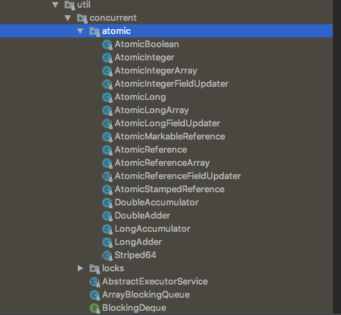
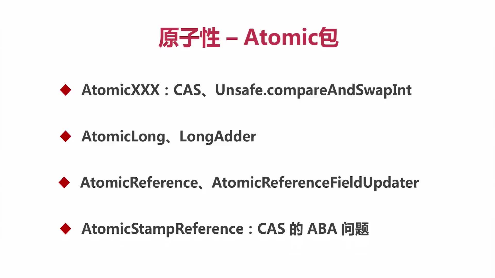

# 第03章 线程安全性

> 参考的博客：https://blog.51cto.com/zero01/2300671

## 3.0 线程安全性概述

> 当多个线程访问某个类时，不管运行时环境采用`何种调度方式`或者这些进程将如何交替执行，并且在主调代码中`不需要任何额外的同步或协同`，这个类都能表现出`正确的行为`，那么就称这个类是线程安全的

线程安全性主要体现在三个方面：

+ `原子性`：提供了互斥访问，同一时刻只能有一个线程来对它进行操作
+ `可见性`：一个线程对主内存的修改可以及时的被其他线程观察到
+ `有序性`：一个线程观察其他线程中的指令执行顺序，由于指令重排的存在，该观察结果一般杂乱无序

## 3.1~3.3 原子性

### 原子包-Atomic包

说到原子性，就不得不提及JDK里的atomic包，该包中提供了很多Atomic的类，本小节主要介绍该包中常用的几个类。这些类都是通过CAS来实现原子性的，atomic包提供了如下具有原子性的类：

> java.util.concurrent.atomic.AtomicXXX

`AtomicXXX`: CAS、Unsafe.compareAndSwap(简称CAS)

### CAS

CAS （compareAndSwap），中文叫比较交换，一种无锁原子算法。过程是这样：它包含 3 个参数 CAS（V，E，N），V表示要更新变量的值Value，E表示预期值Expected，N表示新值New。仅当 V值等于E值时，才会将V的值设为N，如果V值和E值不同，那么说明已经有其他线程做了更新，当前线程则什么都不做。最后，CAS 返回当前V的真实值。CAS 操作时抱着乐观的态度进行的，它总是认为自己可以成功完成操作。

当多个线程同时使用CAS 操作一个变量时，只有一个会胜出，并成功更新，其余均会失败。失败的线程不会挂起，仅是被告知失败，并且允许再次尝试，当然也允许实现的线程放弃操作。基于这样的原理，CAS 操作即使没有锁，也可以发现其他线程对当前线程的干扰。

与锁相比，使用CAS会使程序看起来更加复杂一些，但`由于其非阻塞的，它对死锁问题天生免疫`，并且，线程间的相互影响也非常小。更为重要的是，使用无锁的方式完全没有锁竞争带来的系统开销，也没有线程间频繁调度带来的开销，因此，他要比基于锁的方式拥有更优越的性能。

简单的说，CAS 需要你额外给出一个期望值，也就是你认为这个变量现在应该是什么样子的。如果变量不是你想象的那样，哪说明它已经被别人修改过了。你就需要重新读取，再次尝试修改就好了。

### CAS的缺点：

CAS 看起来非常的吊，但是它仍然有缺点，最著名的就是 ABA 问题：在CAS操作的时候，其他线程将变量的值A改成了B，然后又改成了A。本线程使用期望值A与当前变量进行比较的时候，发现A变量没有变，于是CAS就将A值进行了交换操作。这个时候实际上A值已经被其他线程改变过，这与设计思想是不符合的。

如果只是在基本类型上是没有问题的，但如果是引用类型呢？这个对象中有多个变量，我怎么知道有没有被改过？聪明的你一定想到了，加个版本号啊。每次修改就检查版本号，如果版本号变了，说明改过。这样只要变量被某一个线程修改过，该变量版本号就会发生递增操作，从而解决了ABA问题

### CAS 底层原理：

CAS是如何将比较和交换这两个操作，变成一个原子操作呢？这归功于硬件指令集的发展，实际上，我们可以使用同步将这两个操作变成原子的，但是这么做就没有意义了。所以我们只能靠硬件来完成，硬件保证一个从语义上看起来需要多次操作的行为只通过一条处理器指令就能完成。这类指令常用的有：

+ 测试并设置(Test-and-Set)
+ 获取并增加(Fetch-and-Increment)
+ 交换(Swap)
+ 比较并交换（Compare-and-Swap）
+ 加载链接/条件存储（Load-Linked/Store-Conditional）

其中，前面的3条是20世纪时，大部分处理器已经有了，后面的2条是现代处理器新增的。而且这两条指令的目的和功能是类似的，在IA64，x86 指令集中有 cmpxchg 指令完成 CAS 功能，在 sparc-TSO 也有 casa 指令实现，而在 ARM 和 PowerPC 架构下，则需要使用一对 ldrex/strex 指令来完成 LL/SC 的功能。

CPU 实现原子指令有2种方式：

+ 通过总线锁定来保证原子性：
  > 总线锁定其实就是处理器使用了总线锁，所谓总线锁就是使用处理器提供的一个 LOCK# 信号，当一个处理器在总线上输出此信号时，其他处理器的请求将被阻塞住，那么该处理器可以独占共享内存。但是该方法成本太大。因此有了下面的方式。
+ 通过缓存锁定来保证原子性：
  > 所谓 缓存锁定 是指内存区域如果被缓存在处理器的缓存行中，并且在Lock 操作期间被锁定，那么当他执行锁操作写回到内存时，处理器不在总线上声言 LOCK# 信号，而是修改内部的内存地址，并允许他的缓存一致性机制来保证操作的原子性，因为缓存一致性机制会阻止同时修改两个以上处理器缓存的内存区域数据（这里和 volatile 的可见性原理相同），当其他处理器回写已被锁定的缓存行的数据时，会使缓存行无效。

注意：有两种情况下处理器不会使用缓存锁定：

+ 当操作的数据不能被缓存在处理器内部，或操作的数据跨多个缓存行时，则处理器会调用总线锁定。
+ 有些处理器不支持缓存锁定，对于 Intel 486 和 Pentium 处理器，就是锁定的内存区域在处理器的缓存行也会调用总线锁定。

