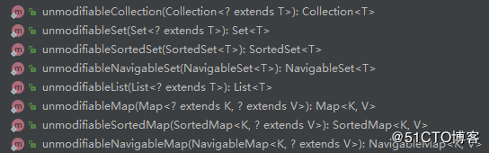

# 第05章 线程安全策略

## 5.1~5.2 不可变对象

### 不可变对象需要满足的条件

+ 对象创建后其状态就不能修改
+ 对象所有域都是final类型
+ 对象是正确创建地(在对象创建期间，this引用没有逸出)

### final关键字

> 可以修饰类、方法和变量

+ 修饰类：不能被继承
+ 修饰方法：
  + 1.锁定方法不能被继承类修改
  + 2.效率高
+ 修饰变量：
  + 1.基本数据类型：数值一旦初始化后便不能修改了
  + 2.引用类型变量：初始化后就不能指向另外一个对象了
+ 修饰方法参数：通修饰变量

### 创建不可变对象的方式(参考String)

+ 将类声明称final类型，使其不可以被继承
+ 将所有的成员设置成私有的，使其他的类和对象不能直接访问这些成员
+ 对变量不提供set方法
+ 将所有可变的成员声明为final，这样只能对他们赋值一次
+ 通过构造器初始化所有成员，进行深度拷贝
+ 在get方法中，不直接返回对象本身，而是克隆对象，返回对象的拷贝

### 使用工具类来完成不可变对象的创建

+ `Collections.unmodifiableXXX`：Collection、List、Set、Map...
+ `Guava`：ImmutableXXX：Collection、List、Set、Map...

```java
@Slf4j
public class ImmutableExample2 {

    private static Map<Integer, Integer> map = Maps.newHashMap();

    static {
        map.put(1, 2);
        // 转换成不可变对象
        map = Collections.unmodifiableMap(map);
    }

    public static void main(String[] args) {
        // 此时map就是不可变对象了，修改会报错
        map.put(1, 3);
        log.info("{}", map.get(1));
    }
}
```

我们来看看是如何将map转换为不可变对象的，源码如下：

```java
/**
 * Returns an <a href="Collection.html#unmodview">unmodifiable view</a> of the
 * specified map. Query operations on the returned map "read through"
 * to the specified map, and attempts to modify the returned
 * map, whether direct or via its collection views, result in an
 * {@code UnsupportedOperationException}.<p>
 *
 * The returned map will be serializable if the specified map
 * is serializable.
 *
 * @param <K> the class of the map keys
 * @param <V> the class of the map values
 * @param  m the map for which an unmodifiable view is to be returned.
 * @return an unmodifiable view of the specified map.
 */
public static <K,V> Map<K,V> unmodifiableMap(Map<? extends K, ? extends V> m) {
    return new UnmodifiableMap<>(m);
}

/**
 * @serial include
 */
private static class UnmodifiableMap<K,V> implements Map<K,V>, Serializable {
    private static final long serialVersionUID = -1034234728574286014L;

    private final Map<? extends K, ? extends V> m;

    UnmodifiableMap(Map<? extends K, ? extends V> m) {
        if (m==null)
            throw new NullPointerException();
        this.m = m;
    }    

    public int size()                        {return m.size();}
    public boolean isEmpty()                 {return m.isEmpty();}
    public boolean containsKey(Object key)   {return m.containsKey(key);}
    public boolean containsValue(Object val) {return m.containsValue(val);}
    public V get(Object key)                 {return m.get(key);}

    public V put(K key, V value) {
        throw new UnsupportedOperationException();
    }
    public V remove(Object key) {
        throw new UnsupportedOperationException();
    }        
...    
```

可以看到，实际上unmodifiableMap方法里是返回了一个内部类UnmodifiableMap的实例。而这个UnmodifiableMap类实现了Map接口，并且在构造器中将我们传入的map对象赋值到了final修饰的属性m中。在该类中除了一些“查询”方法，其他涉及到修改的方法都会抛出UnsupportedOperationException异常，这样外部就无法修改该对象内的数据。我们在调用涉及到修改数据的方法都会报错，这样就实现了将一个可变对象转换成一个不可变的对象。

除了以上示例中所使用的unmodifiableMap方法外，还有许多转换不可变对象的方法，如下：



然后我们再来看看Guava中创建不可变对象的方法，示例代码如下

```java
/***********************************************************
 * @Description : 谷歌的Guava实现不可变对象
 * @author      : 梁山广(Liang Shan Guang)
 * @date        : 2019/8/30 00:09
 * @email       : liangshanguang2@gmail.com
 ***********************************************************/
package com.huawei.l00379880.mythread.Chapter05Immutable.Section2ImmutableObj;

import com.google.common.collect.ImmutableList;
import com.google.common.collect.ImmutableMap;
import com.google.common.collect.ImmutableSet;

public class ImmutableGuava {
    private final static ImmutableList list = ImmutableList.of(1, 2, 3);

    private final static ImmutableSet set = ImmutableSet.copyOf(list);

    // map1和map2是等效的两种不同的初始化的方式
    private final static ImmutableMap<Integer, Integer> map1 = ImmutableMap.of(1, 2, 3, 4);
    private final static ImmutableMap<Integer, Integer> map2 = ImmutableMap.<Integer, Integer>builder()
            .put(1, 2)
            .put(3, 4)
            .build();

    public static void main(String[] args) {
        // 以下四行都会报如下错误，Exception in thread "main" java.lang.UnsupportedOperationException
        list.add(4);
        set.add(4);
        map1.put(1, 4);
        map2.put(1, 4);
    }
}
```

不可变对象的概念也比较简单，又有那么多的工具类可供使用，所以学习起来也不是很困难。由于Guava中实现不可变对象的方式和Collections差不多，所以这里就不对其源码进行介绍了。

## 5.3 线程封闭

在上一小节中，我们介绍了不可变对象，不可变对象在多线程下是线程安全的，因为其避开了并发，而另一个更简单避开并发的的方式就是本小节要介绍的线程封闭。

线程封闭最常见的应用就是用在数据库连接对象上，数据库连接对象本身并不是线程安全的，但由于线程封闭的作用，一个线程只会持有一个连接对象，并且持有的连接对象不会被其他线程所获取，这样就不会有线程安全的问题了。

### 线程封闭的概念

> 把对象封装到一个线程里，只有这个线程能看到这个对象。那么即便这个对象本身不是线程安全的，但由于线程封闭的关系让其只能在一个线程里访问，所以也就不会出现线程安全的问题了

### 实现线程封闭的方式

+ Ad-hoc 线程封闭：完全由程序控制实现，最糟糕的方式，忽略
+ 堆栈封闭：局部变量，无并发问题。当多个线程访问同一个方法的时候，方法内的局部变量都会被拷贝一份副本到线程的栈中，所以局部变量是不会被多个线程所共享的，因此无并发问题。所以我们在开发时应尽量使用局部变量而不是全局变量
+ ThreadLocal 线程封闭：特别好的封闭方法，每个Thread线程内部都有个map，这个map是以线程本地对象作为key，以线程的变量副本作为value。而这个map是由ThreadLocal来维护的，由ThreadLocal负责向map里设置线程的变量值，以及获取值。所以对于不同的线程，每次获取副本值的时候，其他线程都不能获取当前线程的副本值，于是就形成了副本的隔离，多个线程互不干扰。所以这是特别好的实现线程封闭的方式

ThreadLocal 应用的场景也比较多，例如在经典的web项目中，都会涉及到用户的登录。而服务器接收到每个请求都是开启一个线程去处理的，所以我们通常会使用ThreadLocal存储登录的用户信息对象，这样我们就可以方便的在该请求生命周期内的任何位置获取到用户对象，并且不会有线程安全问题。示例代码如下：


```java
/***********************************************************
 * @Description : 使用ThreadLocal实现登录用户的区分
 * @author      : 梁山广(Liang Shan Guang)
 * @date        : 2019/8/30 07:59
 * @email       : liangshanguang2@gmail.com
 ***********************************************************/
package com.huawei.l00379880.mythread.Chapter05Immutable.Section3ThreadIsolate;

public class ThreadLocalRequestHolder {
    private final static ThreadLocal<Long> requestHolder = new ThreadLocal<>();


    public static void add(Long id) {
        // ThreadLocal 内部维护一个map，key为当前线程id，value为当前set的变量
        requestHolder.set(id);
    }

    /**
     * 会通过当前线程id获取数据
     */
    public static Long getId() {
        return requestHolder.get();
    }

    /**
     * 移除变量信息
     * 如果不移除，那么变量不会释放掉，会造成内存泄漏
     */
    public static void remove() {
        requestHolder.remove();
    }
}
```

## 5.4~5.5 线程不安全的类和写法

### 1.字符串拼接，StringBuffer和StringBuilder

在Java里提供了两个类可完成字符串拼接，就是StringBuilder和StringBuffer，其中`StringBuilder是线程不安全的，而StringBuffer是线程安全的`

StringBuffer之所以是线程安全的原因是`几乎所有的方法都加了synchronized关键字`，所以是线程安全的。但是由于StringBuffer 是以加 synchronized 这种暴力的方式保证的线程安全，所以性能会相对较差，在堆栈封闭等线程安全的环境下应该首先选用StringBuilder。

```java
/***********************************************************
 * @Description : StringBuilder与StringBuffer
 * @author      : 梁山广(Liang Shan Guang)
 * @date        : 2019/8/30 08:15
 * @email       : liangshanguang2@gmail.com
 ***********************************************************/
package com.huawei.l00379880.mythread.Chapter05Immutable.Section4And5UnsafeThreadExample;

import java.util.concurrent.CountDownLatch;
import java.util.concurrent.ExecutorService;
import java.util.concurrent.Executors;
import java.util.concurrent.Semaphore;

public class StringBufferBuilder {
    /**
     * 请求总数
     */
    public static int clientTotal = 5000;
    /**
     * 同时并发执行地线程数
     */
    public static int threadTotal = 200;
    public static StringBuilder sb = new StringBuilder();

    public static void main(String[] args) throws InterruptedException {
        ExecutorService executorService = Executors.newCachedThreadPool();
        final Semaphore semaphore = new Semaphore(threadTotal);
        final CountDownLatch countDownLatch = new CountDownLatch(clientTotal);
        for (int i = 0; i < clientTotal; i++) {
            executorService.execute(() -> {
                try {
                    semaphore.acquire();
                    update();
                    semaphore.release();
                } catch (InterruptedException e) {
                    e.printStackTrace();
                }
                countDownLatch.countDown();
            });
        }
        countDownLatch.await();
        executorService.shutdown();
        // 按理说长度该是5000，但是由于StringBuilder不是线程安全的，所以结果一般会小于5000,改成StringBuffer就好了，但是效率比StringBuilder低
        System.out.println(sb.length());
    }

    private static void update() {
        sb.append("1");
    }
}
```

### 2.SimpleDateFormat-->joda-time.DateTimeFormatter
    
SimpleDateFormat 的实例对象在多线程共享使用的时候会抛出转换异常，正确的使用方法应该是`采用堆栈封闭，将其作为方法内的局部变量而不是全局变量`，在每次调用方法的时候才去创建一个SimpleDateFormat实例对象，这样利于堆栈封闭就不会出现并发问题。另一种方式是使用第三方库`joda-time的DateTimeFormatter类`(项目中推荐使用)

```java
package com.huawei.l00379880.mythread.Chapter05Immutable.Section4And5UnsafeThreadExample;

import org.joda.time.DateTime;
import org.joda.time.format.DateTimeFormat;
import org.joda.time.format.DateTimeFormatter;

import java.text.ParseException;
import java.util.concurrent.CountDownLatch;
import java.util.concurrent.ExecutorService;
import java.util.concurrent.Executors;
import java.util.concurrent.Semaphore;

/***********************************************************
 * @note      : Joda的时间类测试
 * @author    : l00379880 梁山广
 * @version   : V1.0 at 2019/8/30 9:30
 ***********************************************************/
public class JodaTimeTest {
    /**
     * 请求总数
     */
    public static int clientTotal = 5000;
    /**
     * 同时并发执行地线程数
     */
    public static int threadTotal = 200;

    private static DateTimeFormatter dateTimeFormatter = DateTimeFormat.forPattern("yyyyMMdd");

    public static void main(String[] args) throws InterruptedException {
        ExecutorService executorService = Executors.newCachedThreadPool();
        final Semaphore semaphore = new Semaphore(threadTotal);
        final CountDownLatch countDownLatch = new CountDownLatch(clientTotal);
        for (int i = 0; i < clientTotal; i++) {
            int finalI = i;
            executorService.execute(() -> {
                try {
                    semaphore.acquire();
                    update(finalI);
                    semaphore.release();
                } catch (InterruptedException e) {
                    e.printStackTrace();
                }
                countDownLatch.countDown();
            });
        }
        countDownLatch.await();
        executorService.shutdown();
    }

    private static void update(int finalI) {
        // 这里就不会报异常了，而且不需要把dateTimeFormatter声明为线程局部变量
        System.out.println("第" + finalI + "次循环" + DateTime.parse("20190830", dateTimeFormatter).toDate());
    }
}
```

### 3.ArrayList, HashMap, HashSet 等 Collections 都是线程不安全的

> 这几个集合类特别重要，后面会单独讲他们的线程安全类

```java
package com.huawei.l00379880.mythread.Chapter05Immutable.Section4And5UnsafeThreadExample;

import java.util.*;
import java.util.concurrent.CountDownLatch;
import java.util.concurrent.ExecutorService;
import java.util.concurrent.Executors;
import java.util.concurrent.Semaphore;

/***********************************************************
 * @note      : 
 * @author    : l00379880 梁山广
 * @version   : V1.0 at 2019/8/30 9:44
 ***********************************************************/
public class CollectionsTest {
    /**
     * 请求总数
     */
    public static int clientTotal = 5000;
    /**
     * 同时并发执行地线程数
     */
    public static int threadTotal = 200;

    private static List<Integer> list = new ArrayList<>();
    private static Set<Integer> set = new HashSet<>();
    private static Map<Integer, Integer> map = new HashMap<>();

    public static void main(String[] args) throws InterruptedException {
        ExecutorService executorService = Executors.newCachedThreadPool();
        final Semaphore semaphore = new Semaphore(threadTotal);
        final CountDownLatch countDownLatch = new CountDownLatch(clientTotal);
        for (int i = 0; i < clientTotal; i++) {
            int finalI = i;
            executorService.execute(() -> {
                try {
                    semaphore.acquire();
                    update(finalI);
                    semaphore.release();
                } catch (InterruptedException e) {
                    e.printStackTrace();
                }
                countDownLatch.countDown();
            });
        }
        countDownLatch.await();
        executorService.shutdown();
        System.out.println("list:" + list.size());
        System.out.println("set:" + set.size());
        System.out.println("map:" + map.size());

    }

    private static void update(int finalI) {
        list.add(finalI);
        set.add(finalI);
        map.put(finalI, finalI);
    }
}
/**
 * 输出结果(都小于5000，可见List、Set、Map都不是线程安全地)：
 * <p>
 * list:4996
 * set:4993
 * map:4992
 */
```

### 4.有一种写法需要注意

> 即便是线程安全的对象，在这种写法下也可能会出现线程不安全的行为，这种写法就是`先检查后执行`：

```java
if(condition(a)){
    handle(a);
}
```
在这个操作里，可能会有两个线程同时通过if的判断，然后去执行了处理方法，那么就会出现两个线程同时操作一个对象，从而出现线程不安全的行为。这种写法导致线程不安全的主要原因是因为这里分成了两步操作，这个过程是非原子性的，所以就会出现线程不安全的问题。

## 5.6~5.7 同步容器

在上一小节中，我们提到了一些常用的线程不安全的集合容器，当我们在使用这些容器时，需要自行处理线程安全问题。所以使用起来相对会有些不便，而Java在这方面提供了相应的同步容器，我们可以在多线程情况下可以结合实际场景考虑使用这些同步容器。

在Java中同步容器主要分为两类，

### 一类是集合接口下的同步容器实现类：

+ `List` -> Vector、Stack
+ `Map` -> HashTable（key、value不能为null）

> Vector的所有方法都是有synchronized关键字保护的，Stack继承了Vector，并且提供了栈操作(先进后出)，而hashtable也是由synchronized关键字保护

代码见[同步容器1](src/main/java/com/huawei/l00379880/mythread/Chapter05Immutable/Section6And7SynchronizedCollections/CollectionsTestSafe.java)

但是需要注意的是同步容器也并不一定是绝对线程安全的，例如有两个线程，线程A根据size的值循环执行remove操作，而线程B根据size的值循环执行执行get操作。它们都需要调用size获取容器大小，当循环到最后一个元素时，若线程A先remove了线程B需要get的元素，那么就会报越界错误。错误示例如下：

```java
package com.huawei.l00379880.mythread.Chapter05Immutable.Section6And7SynchronizedCollections;

import java.util.Vector;

/***********************************************************
 * @note      : Vector在循环中删除元素时可能会出现不安全的情况(越界错误)
 * @author    : l00379880 梁山广
 * @version   : V1.0 at 2019/8/30 10:34
 ***********************************************************/
public class VectorUnsafeExample {
    private static Vector<Integer> vector = new Vector<>();

    public static void main(String[] args) {
        for (int i = 0; i < 10; i++) {
            vector.add(i);
        }

        Thread thread1 = new Thread() {
            @Override
            public void run() {
                for (int i = 0; i < 10; i++) {
                    vector.remove(i);
                }
            }
        };

        Thread thread2 = new Thread() {
            @Override
            public void run() {
                for (int i = 0; i < 10; i++) {
                    vector.get(i);
                }
            }
        };

        thread1.start();
        thread2.start();
    }
}

/**
 * 输出结果(Vector在循环中删除元素是极其不安全的)：
 * <p>
 * Exception in thread "Thread-0" java.lang.ArrayIndexOutOfBoundsException: Array index out of range: 5
 * 	at java.util.Vector.remove(Vector.java:831)
 * 	at com.huawei.l00379880.mythread.Chapter05Immutable.Section6And7SynchronizedCollections.VectorUnsafeExample$1.run(VectorUnsafeExample.java:23)
 * Exception in thread "Thread-1" java.lang.ArrayIndexOutOfBoundsException: Array index out of range: 5
 * 	at java.util.Vector.get(Vector.java:748)
 * 	at com.huawei.l00379880.mythread.Chapter05Immutable.Section6And7SynchronizedCollections.VectorUnsafeExample$2.run(VectorUnsafeExample.java:32)
 * 	...
 */
```

另外还有一点需要注意的是，当我们使用foreach循环或迭代器去遍历元素的同时又执行删除操作的话，`即便在单线程下也会报并发修改异常`。示例代码如下：

```java
public class VectorExample3 {

    private static void test1(Vector<Integer> v1) {
        // 在遍历的同时进行了删除的操作，会抛出java.util.ConcurrentModificationException并发修改异常
        for (Integer integer : v1) {
            if (integer.equals(5)) {
                v1.remove(integer);
            }
        }
    }

    private static void test2(Vector<Integer> v1) {
        // 在遍历的同时进行了删除的操作，会抛出java.util.ConcurrentModificationException并发修改异常
        Iterator<Integer> iterator = v1.iterator();
        while (iterator.hasNext()) {
            Integer integer = iterator.next();
            if (integer.equals(5)) {
                v1.remove(integer);
            }
        }
    }

    private static void test3(Vector<Integer> v1) {
        // 可以正常删除
        for (int i = 0; i < v1.size(); i++) {
            if (v1.get(i).equals(5)) {
                v1.remove(i);
            }
        }
    }

    public static void main(String[] args) {
        Vector<Integer> vector = new Vector<>();
        for (int i = 1; i <= 5; i++) {
            vector.add(i);
        }
        test1(vector);
//        test2(vector);
//        test3(vector);
    }
}
```

所以
+ 在`foreach循环(test1)`或`迭代器遍历(test2)`的过程中不能做删除操作
+ 若需遍历的同时进行删除操作的话尽量使用`fori循环(test3)`
+ 实在要使用foreach循环或迭代器的话应`该先标记要删除元素的下标，然后最后再统一删除`

如下示例：

```java
private static void test4(Vector<Integer> v1) {
    int delIndex = 0;
    for (Integer integer : v1) {
        if (integer.equals(5)) {
            delIndex = v1.indexOf(integer);
        }
    }
    v1.remove(delIndex);
}
```

最方便的方式就是使用jdk1.8提供的函数式编程接口：

```java
private static void test5(Vector<Integer> v1){
    v1.removeIf((i) -> i.equals(5));
}
```

### 2.第二类是Collections.synchronizedXXX (list,set,map)方法所创建的同步容器

示例代码：

```java
package com.huawei.l00379880.mythread.Chapter05Immutable.Section6And7SynchronizedCollections;

import java.util.*;
import java.util.concurrent.CountDownLatch;
import java.util.concurrent.ExecutorService;
import java.util.concurrent.Executors;
import java.util.concurrent.Semaphore;

/***********************************************************
 * @note      : Collections.synchronizedXXX可以把原始集合转化为线程安全的集合
 * @author    : l00379880 梁山广
 * @version   : V1.0 at 2019/8/30 10:52
 ***********************************************************/
public class CollectionsTestSafe2 {
    /**
     * 请求总数
     */
    public static int clientTotal = 5000;
    /**
     * 同时并发执行地线程数
     */
    public static int threadTotal = 200;

    private static List<Integer> list = Collections.synchronizedList(new ArrayList<>());
    private static Set<Integer> set = Collections.synchronizedSet(new HashSet<>());
    private static Map<Integer, Integer> map = Collections.synchronizedMap(new HashMap<>());

    public static void main(String[] args) throws InterruptedException {
        ExecutorService executorService = Executors.newCachedThreadPool();
        final Semaphore semaphore = new Semaphore(threadTotal);
        final CountDownLatch countDownLatch = new CountDownLatch(clientTotal);
        for (int i = 0; i < clientTotal; i++) {
            int finalI = i;
            executorService.execute(() -> {
                try {
                    semaphore.acquire();
                    update(finalI);
                    semaphore.release();
                } catch (InterruptedException e) {
                    e.printStackTrace();
                }
                countDownLatch.countDown();
            });
        }
        countDownLatch.await();
        executorService.shutdown();
        System.out.println("list:" + list.size());
        System.out.println("set:" + set.size());
        System.out.println("map:" + map.size());

    }

    private static void update(int finalI) {
        list.add(finalI);
        set.add(finalI);
        map.put(finalI, finalI);
    }
}
/**
 * 输出结果(Collections.synchronizedXXX可以把原始集合转化为线程安全的集合)：
 * <p>
 * list:5000
 * set:5000
 * map:5000
 */
```

## 5.8 并发容器

在上一小节中，我们简单介绍了常见的同步容器，知道了同步容器是通过`synchronized来实现同步的，所以性能较差`。而且同步容器也并不是绝对线程安全的，在一些特殊情况下也会出现线程不安全的行为。那么有没有更好的方式代替同步容器呢？答案是有的，那就是并发容器，`有了并发容器后同步容器的使用也越来越少的，大部分都会优先使用并发容器`。本小节将简单介绍一下并发容器，并发容器也称为`J.U.C`，即是其包名：`java.util.concurrent`,常见的并发容器如下：

+ List
  + ArrayList对应的CopyOnWriteArrayList
+ Set
  + HashSet对应的CopyOnWriteArraySet
  + TreeSet对应的ConcurrentSkipListSet
+ Map
  + HashMap对应的ConcurrentHashMap
  + TreeMap对应的ConcurrentSkipListMap

下面逐个进行讲解

### 5.8.1 ArrayList对应的CopyOnWriteArrayList：

CopyOnWrite容器即写时复制的容器。通俗的理解是当我们往一个容器添加元素的时候，不直接往当前容器添加，而是先将当前容器进行Copy，复制出一个新的容器，然后新的容器里添加元素，添加完元素之后，再将原容器的引用指向新的容器。这样做的好处是我们可以对CopyOnWrite容器进行并发的读，而不需要加锁，因为当前容器不会添加任何元素。所以CopyOnWrite容器也是一种读写分离的思想，读和写不同的容器。而在CopyOnWriteArrayList写的过程是会加锁的，即调用add的时候，否则多线程写的时候会Copy出N个副本出来。

CopyOnWriteArrayList.add()方法源码如下（jdk11版本）：

```java
/**
 * Appends the specified element to the end of this list.
 *
 * @param e element to be appended to this list
 * @return {@code true} (as specified by {@link Collection#add})
 */
public boolean add(E e) {
    //1、先加锁
    synchronized (lock) {
        Object[] es = getArray();
        int len = es.length;
        //2、拷贝数组
        es = Arrays.copyOf(es, len + 1);
        //3、将元素加入到新数组中
        es[len] = e;
        //4、将array引用指向到新数组
        setArray(es);
        return true;
    }
}
```

读的时候不需要加锁，但是如果读的时候有多个线程正在向CopyOnWriteArrayList添加数据，读还是会读到旧的数据，因为写的时候不会锁住旧的CopyOnWriteArrayList。`CopyOnWriteArrayList.get()`方法源码如下（jdk11版本）：

```java
/**
 * {@inheritDoc}
 *
 * @throws IndexOutOfBoundsException {@inheritDoc}
 */
public E get(int index) {
    return elementAt(getArray(), index);
}
```

#### CopyOnWriteArrayList容器有很多优点，但是同时也存在两个问题，即`内存占用问题`和`数据一致性问题`

+ 内存占用问题：
  > 因为CopyOnWriteArrayList的写操作时的复制机制，所以在进行写操作的时候，内存里会同时驻扎两个对象的内存，旧的对象和新写入的对象（注意:在复制的时候只是复制容器里的引用，只是在写的时候会创建新对象添加到新容器里，而旧容器的对象还在使用，所以有两份对象内存）。如果这些对象占用的内存比较大，比如说200M左右，那么再写入100M数据进去，内存就会占用300M，那么这个时候很有可能造成频繁的Yong GC和Full GC。之前我们系统中使用了一个服务由于每晚使用CopyOnWrite机制更新大对象，造成了每晚15秒的Full GC，应用响应时间也随之变长。

针对内存占用问题，可以通过压缩容器中的元素的方法来减少大对象的内存消耗，比如，如果元素全是10进制的数字，可以考虑把它压缩成36进制或64进制。或者不使用CopyOnWrite容器，而使用其他的并发容器，如ConcurrentHashMap。

+ 数据一致性问题：
  > CopyOnWriteArrayList容器只能保证数据的最终一致性，不能保证数据的实时一致性。所以如果你希望写入的的数据，马上能读到，即实时读取场景，那么请不要使用CopyOnWriteArrayList容器。
  
#### CopyOnWrite的应用场景：

综上，CopyOnWriteArrayList并发容器用于`读多写少的并发场景`。不过这类慎用因为谁也没法保证CopyOnWriteArrayList 到底要放置多少数据，万一数据稍微有点多，每次add/set都要重新复制数组，这个代价实在太高昂了。在高性能的互联网应用中，这种操作分分钟引起故障。

#### 参考文章：

http://ifeve.com/java-copy-on-write/#more-10403

### 5.8.2 HashSet对应的CopyOnWriteArraySet

CopyOnWriteArraySet是线程安全的，它底层的实现使用了CopyOnWriteArrayList，因此和CopyOnWriteArrayList概念是类似的。使用迭代器进行遍历的速度很快，并且不会与其他线程发生冲突。在构造迭代器时，迭代器依赖于不可变的数组快照，所以迭代器不支持可变的 remove 操作。

#### CopyOnWriteArraySet适合于具有以下特征的场景：

> set 大小通常保持很小，只读操作远多于可变操作，需要在遍历期间防止线程间的冲突。
CopyOnWriteArraySet缺点：

因为通常需要复制整个基础数组，所以`可变操作(add、set 和 remove 等等)的开销很大`

### 5.8.3 TreeSet对应的ConcurrentSkipListSet

ConcurrentSkipListSet是jdk6新增的类，它和TreeSet一样是支持自然排序的，并且可以在构造的时候定义Comparator的比较器，该类的方法基本和TreeSet中方法一样(方法签名一样)。和其他的Set集合一样，`ConcurrentSkipListSet是基于Map集合的`，ConcurrentSkipListMap便是它的底层实现

在多线程的环境下，ConcurrentSkipListSet中的`contains、add、remove操作是安全的`，多个线程可以安全地并发执行插入、移除和访问操作。

但是对于`批量操作 addAll、removeAll、retainAll 和 containsAll并不能保证以原子方式执行`。理由很简单，因为addAll、removeAll、retainAll底层调用的还是contains、add、remove的方法，在批量操作时，只能保证每一次的contains、add、remove的操作是原子性的（即在进行contains、add、remove三个操作时，不会被其他线程打断），而不能保证每一次批量的操作都不会被其他线程打断。所以在进行批量操作时，需自行额外手动做一些同步、加锁措施，以此保证线程安全。另外，ConcurrentSkipListSet类不允许使用 null 元素，因为无法可靠地将 null 参数及返回值与不存在的元素区分开来。

### 5.8.4 HashMap对应的ConcurrentHashMap

HashMap的并发安全版本是ConcurrentHashMap，但ConcurrentHashMap不允许 null 值。在大多数情况下，我们使用map都是读取操作，写操作比较少。因此ConcurrentHashMap针对读取操作做了大量的优化，所以ConcurrentHashMap具有很高的并发性，在高并发场景下表现良好。

关于HashMap与ConcurrentHashMap容器详细的内容请参考如下文章：  
[HashMap? ConcurrentHashMap? 相信看完这篇没人能难住你！](https://blog.51cto.com/zero01/2307070)

### 5.8.5 TreeMap对应的ConcurrentSkipListMap

ConcurrentSkipListMap的底层是通过跳表来实现的。跳表是一个链表，但是通过使用“跳跃式”查找的方式使得插入、读取数据时复杂度变成了O(logn)。

有人曾比较过ConcurrentHashMap和ConcurrentSkipListMap的性能，在4线程1.6万数据的条件下，ConcurrentHashMap 存取速度是ConcurrentSkipListMap 的4倍左右。

#### 但**ConcurrentSkipListMap有几个ConcurrentHashMap不能比拟的优点：**

+ ConcurrentSkipListMap 的`key是有序的`
+ ConcurrentSkipListMap `支持更高的并发`。ConcurrentSkipListMap的存取时间是O(logn)，和线程数几乎无关。也就是说在数据量一定的情况下，并发的线程越多，ConcurrentSkipListMap越能体现出其优势

#### 各种Map的使用场景

+ 在非多线程的情况下，应当尽量使用TreeMap。
+ 此外对于并发性相对较低的并行程序可以使Collections.synchronizedSortedMap将TreeMap进行包装，也可以提供较好的效率。
+ 对于高并发程序，应当使用ConcurrentSkipListMap，能够提供更高的并发度。
+ 所以在多线程程序中，如果需要对Map的键值进行排序时，请尽量使用ConcurrentSkipListMap，可能得到更好的并发度。
  > 注意，调用ConcurrentSkipListMap的size时，由于多个线程可以同时对映射表进行操作，所以映射表需要遍历整个链表才能返回元素个数，这个操作是个O(log(n))的操作。
  
### 5.8.6 测试代码

```java
package com.huawei.l00379880.mythread.Chapter05Immutable.Section8JUC;

import java.util.*;
import java.util.concurrent.*;

/***********************************************************
 * @note      : 并发容器，都是线程安全的
 * List
 *   ArrayList对应的CopyOnWriteArrayList
 * Set
 *   HashSet对应的CopyOnWriteArraySet
 *   TreeSet对应的ConcurrentSkipListSet
 * Map
 *   HashMap对应的ConcurrentHashMap
 *   TreeMap对应的ConcurrentSkipListMap
 * @author    : l00379880 梁山广
 * @version   : V1.0 at 2019/8/30 10:52
 ***********************************************************/
public class JUCTest {
    /**
     * 请求总数
     */
    public static int clientTotal = 5000;
    /**
     * 同时并发执行地线程数
     */
    public static int threadTotal = 200;

    private static List<Integer> list = new CopyOnWriteArrayList<>();
    private static Set<Integer> set1 = new CopyOnWriteArraySet<>();
    private static Set<Integer> set2 = new ConcurrentSkipListSet<>();
    private static Map<Integer, Integer> map1 = new ConcurrentHashMap<>();
    private static Map<Integer, Integer> map2 = new ConcurrentSkipListMap<>();

    public static void main(String[] args) throws InterruptedException {
        ExecutorService executorService = Executors.newCachedThreadPool();
        final Semaphore semaphore = new Semaphore(threadTotal);
        final CountDownLatch countDownLatch = new CountDownLatch(clientTotal);
        for (int i = 0; i < clientTotal; i++) {
            int finalI = i;
            executorService.execute(() -> {
                try {
                    semaphore.acquire();
                    update(finalI);
                    semaphore.release();
                } catch (InterruptedException e) {
                    e.printStackTrace();
                }
                countDownLatch.countDown();
            });
        }
        countDownLatch.await();
        executorService.shutdown();
        System.out.println("list:" + list.size());
        System.out.println("set1:" + set1.size());
        System.out.println("set2:" + set2.size());
        System.out.println("map1:" + map1.size());
        System.out.println("map2:" + map2.size());

    }

    private static void update(int finalI) {
        list.add(finalI);
        set1.add(finalI);
        set2.add(finalI);
        map1.put(finalI, finalI);
        map2.put(finalI, finalI);
    }
}
/**
 * 输出结果(并发)：
 * <p>
 * list:5000
 * set1:5000
 * set2:5000
 * map1:5000
 * map2:50000
 */
```

### 5.8.7 JUC的体系结构


