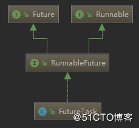
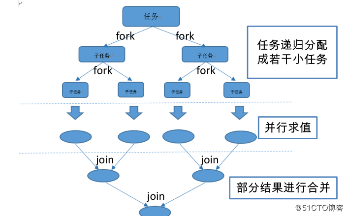
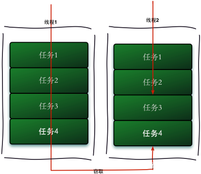
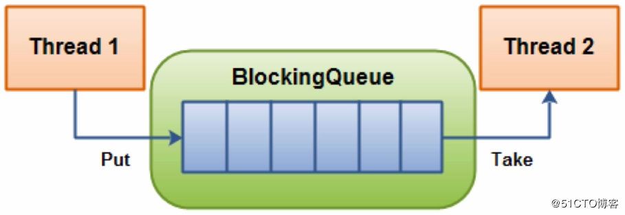

# 第7章 JUC组件扩展

## 7.1~7.2 FutureTask

### 简介

在Java中一般通过继承Thread类或者实现Runnable接口这两种方式来创建线程，但是这两种方式都有个缺陷，就是不能在执行完成后获取执行的结果，因此Java 1.5之后提供了Callable和Future接口，通过它们就可以在任务执行完毕之后得到任务的执行结果。

而FutureTask则是J.U.C中的类，但不是AQS的子类，FutureTask是一个可删除的异步计算类。这个类提供了Future接口的的基本实现，使用相关方法启动和取消计算，查询计算是否完成，并检索计算结果。只有在计算完成时才能使用get方法检索结果;如果计算尚未完成，get方法将会阻塞。一旦计算完成，计算就不能重新启动或取消(除非使用runAndReset方法调用计算)。

### Runnable、Callable、Future接口对比

+ Runnable是一个接口，在它里面只声明了一个run()方法。由于run()方法返回值为void类型，所以在`执行完任务之后无法返回任何结果`：
  ```java
  public interface Runnable {
      public abstract void run();
  }
  ```
+ Callable接口也只声明了一个方法，这个方法叫做call()。Callable接口定义如下:
  ```java
  public interface Callable<V> {
      /**
       * Computes a result, or throws an exception if unable to do so.
       *
       * @return computed result
       * @throws Exception if unable to compute a result
       */
      V call() throws Exception;
  }
  ```
  > 可以看到Callable是个泛型接口，泛型V就是要call()方法返回的类型。Callable接口和Runnable接口很像，都可以被另外一个线程执行，但是正如前面所说的，Runnable不会返回数据也不能抛出异常。 
+ Future也是一个接口，Future接口`代表异步计算的结果`，通过Future接口提供的方法可以查看异步计算是否执行完成，或者等待执行结果并获取执行结果，同时还可以取消执行。说白了Future就是对于具体的Runnable或者Callable任务的执行结果进行取消、查询是否完成以及获取执行结果。其中执行结果通过get方法获取，该方法会阻塞直到任务返回结果。Future接口的定义如下：
  ```java
  public interface Future<V> {
      boolean cancel(boolean mayInterruptIfRunning);
      boolean isCancelled();
      boolean isDone();
      V get() throws InterruptedException, ExecutionException;
      V get(long timeout, TimeUnit unit) throws InterruptedException, ExecutionException, TimeoutException;
  }
  ```

### Future接口中的方法介绍

```java
public interface Future<V> {
    boolean cancel(boolean mayInterruptIfRunning);
    boolean isCancelled();
    boolean isDone();
    V get() throws InterruptedException, ExecutionException;
    V get(long timeout, TimeUnit unit) throws InterruptedException, ExecutionException, TimeoutException;
}
```

+ `boolean cancel(boolean mayInterruptIfRunning);`:cancel()方法用来取消异步任务的执行
  + 如果异步任务已经完成或者已经被取消，或者由于某些原因不能取消，则会返回false。
  + 如果任务还没有被执行，则会返回true并且异步任务不会被执行。
  + 如果任务已经开始执行了但是还没有执行完成
    + 若mayInterruptIfRunning为true，则会立即中断执行任务的线程并返回true
    + 若mayInterruptIfRunning为false，则会返回true且不会中断任务执行线程
+ `boolean isCancelled();`:用于判断任务是否被取消
  + 如果任务在结束(正常执行结束或者执行异常结束)前被取消则返回true
  + 否则返回false。
+ `boolean isDone();`:用于判断任务是否已经完成，
  + 如果完成则返回true，
  + 否则返回false。
  + 需要注意的是：任务执行过程中发生异常、任务被取消也属于任务已完成，也会返回true。
+ `V get();`:用于获取任务执行结果
  + 如果任务`还没完成`则会阻塞等待直到任务执行完成。
  + 如果任务`被取消`则会抛出CancellationException异常
  + 如果任务`执行过程发生异常`则会抛出ExecutionException异常
  + 如果`阻塞等待过程中被中断`则会抛出InterruptedException异常
+ `V get(long timeout, TimeUnit unit);`:带超时时间的get()版本，如果阻塞等待过程中超时则会抛出TimeoutException异常。

综上，Future接口提供了三种功能：
+ 判断任务是否完成
+ 中断任务
+ 获取任务执行结果

### Future与FutureTask的关系

因为Future只是一个接口，所以是无法直接用来创建对象使用的，因此就有了下面的FutureTask。FutureTask的父类是RunnableFuture，而RunnableFuture则继承了Runnable和Future这两个接口。所以由此可知，FutureTask最终也属于是Callable类型的任务。如果往FutureTask的构造函数传入Runnable的话，也会被转换成Callable类型。

FutureTask继承图如下：



可以看到，FutureTask实现了RunnableFuture接口，则RunnableFuture接口继承了Runnable接口和Future接口，所以FutureTask既能当做一个Runnable直接被Thread执行，也能作为Future用来得到Callable的计算结果。

### FutureTask的使用场景

假设有一个很费时的逻辑需要计算，并且需要返回计算的结果，但这个结果又不是马上需要的。那么这时就可以使用FutureTask，用另外一个线程去进行计算，而当前线程在得到这个计算结果之前，就可以去执行其他的操作，等到需要这个结果时再通过Future得到即可。

### FutureTask的构造器

FutureTask有两个构造器，支持传入Callable和Runnable类型，在使用 Runnable 时，需要多指定一个返回结果类型：

```java
public FutureTask(Callable<V> callable) {
    if (callable == null)
        throw new NullPointerException();
    this.callable = callable;
    this.state = NEW;       // ensure visibility of callable
}

public FutureTask(Runnable runnable, V result) {
    this.callable = Executors.callable(runnable, result);
    this.state = NEW;       // ensure visibility of callable
}
```

### 使用示例

#### 1.Future基本使用示例

```java
@Slf4j
public class FutureExample {

    public static void main(String[] args) throws Exception {
        ExecutorService executorService = Executors.newCachedThreadPool();
        // 使用lambda创建callable任务，使用Future接收任务执行的结果
        Future<String> future = executorService.submit(() -> {
            log.info("do something in callable");
            Thread.sleep(5000);

            return "Done";
        });

        log.info("do something in main");
        Thread.sleep(1000);
        // 获取执行结果
        String result = future.get();
        log.info("result: {}", result);
        executorService.shutdown();
    }
}
```

#### 2.FutureTask基本使用示例：

```java
@Slf4j
public class FutureTaskExample {

    public static void main(String[] args) throws Exception {
        // 构建FutureTask实例，使用lambda创建callable任务
        FutureTask<String> futureTask = new FutureTask<>(() -> {
            log.info("do something in callable");
            Thread.sleep(5000);

            return "Done";
        });

        ExecutorService executorService = Executors.newCachedThreadPool();
        executorService.execute(futureTask);

        log.info("do something in main");
        Thread.sleep(1000);
        // 获取执行结果
        String result = futureTask.get();
        log.info("result: {}", result);
        executorService.shutdown();
    }
}
```

从以上两个示例可以看到，Future和FutureTask的使用方式是很相似的，毕竟FutureTask就是Future的一个实现。

## 7.3 ForkJoin

### 基本介绍

Fork/Join框架是Java7提供了的一个用于并行执行任务的框架， 是一个`把大任务分割成若干个小任务，最终汇总每个小任务结果后得到大任务结果`的框架，其思想和map-reduce非常类似。

我们再通过Fork和Join这两个单词来理解下Fork/Join框架，Fork就是把一个大任务切分为若干子任务并行的执行，Join就是合并这些子任务的执行结果，最后得到这个大任务的结果。比如计算1+2+。。＋10000，可以分割成10个子任务，每个子任务分别对1000个数进行求和，最终汇总这10个子任务的结果。Fork/Join的运行流程图如下：



### ForkJoin原理：工作窃取算法

#### 运行流程图

Fork/Join框架主要采用的是工作窃取（work-stealing）算法，该算法是指某个线程从其他队列里窃取任务来执行。工作窃取的运行流程图如下：



#### 那么为什么需要使用工作窃取算法呢？

假如我们需要做一个比较大的任务，我们可以把这个任务分割为若干互不依赖的子任务，为了减少线程间的竞争，于是把这些子任务分别放到不同的队列里，并为每个队列创建一个单独的线程来执行队列里的任务，线程和队列一一对应，比如A线程负责处理A队列里的任务。但是有的线程会先把自己队列里的任务干完，而其他线程对应的队列里还有任务等待处理。干完活的线程与其等着，不如去帮其他线程干活，于是它就去其他线程的队列里窃取一个任务来执行。而在这时它们会访问同一个队列，所以为了减少窃取任务线程和被窃取任务线程之间的竞争，通常会使用双端队列，`被窃取任务线程永远从双端队列的头部拿任务执行，而窃取任务的线程永远从双端队列的尾部拿任务执行`

#### 工作窃取算法的优缺点

+ **优点**是`充分利用线程进行并行计算，并减少了线程间的竞争`
+ **缺点**是在`某些情况下还是存在竞争`，比如双端队列里只有一个任务时。并且消耗了更多的系统资源，比如创建多个线程和多个双端队列

所以对于Fork/Join框架而言，当一个任务正在等待它使用join操作创建的子任务的结束时，执行这个任务的线程（工作线程）查找其他未被执行的任务并开始它的执行。通过这种方式，线程充分利用它们的运行时间，从而提高了应用程序的性能。

为实现这个目标，Fork/Join框架执行的任务有以下**局限性**：

+ 任务只能使用`fork()`和`join()`操作，作为同步机制。如果使用其他同步机制，工作线程不能执行其他任务，当它们在同步操作时。比如，在Fork/Join框架中，你使任务进入睡眠，那么在这睡眠期间内，正在执行这个任务的工作线程将不会执行其他任务。
+ 任务不应该执行I/O操作，如读或写数据文件。
+ 任务不能抛出检查异常，它必须包括必要的代码来处理它们。

Fork/Join框架的核心主要是以下两个类：

+ `ForkJoinPool`：它实现ExecutorService接口和work-stealing算法。它管理工作线程和提供关于任务的状态和它们执行的信息。
+ `ForkJoinTask`： 它是将在ForkJoinPool中执行的任务的基类。它提供在任务中执行fork()和join()操作的机制，并且这两个方法控制任务的状态。通常， 为了实现你的Fork/Join任务，你将实现两个子类的子类的类：RecursiveAction对于没有返回结果的任务和RecursiveTask 对于返回结果的任务。


#### 代码示例

```java
package com.huawei.l00379880.mythread.Chapter07JUCMore.Section3ForkJoin;

import java.util.concurrent.*;

/***********************************************************
 * @note      : Fork-Join使用示例，完成1+2+3+4...+n的计算
 * @author    : l00379880 梁山广
 * @version   : V1.0 at 2019/9/4 11:18
 ***********************************************************/
public class ForkJoinTaskExample extends RecursiveTask<Integer> {
    private static final int THRESHHOLD = 2;
    private int start;
    private int end;

    public ForkJoinTaskExample(int start, int end) {
        this.start = start;
        this.end = end;
    }


    @Override
    protected Integer compute() {
        int sum = 0;

        // 如果任务足够小就直接计算任务
        boolean canCompute = (end - start) <= THRESHHOLD;
        if (canCompute) {
            for (int i = start; i <= end; i++) {
                sum += i;
            }
        } else {
            // 如果任务大于阈值，就分裂成两个子任务计算
            int middle = (start + end) / 2;
            ForkJoinTaskExample lesfTask = new ForkJoinTaskExample(start, middle);
            ForkJoinTaskExample rightTask = new ForkJoinTaskExample(middle + 1, end);

            // 执行子任务
            lesfTask.fork();
            rightTask.fork();

            // 等待子任务执行结束合并其结果
            int leftResult = lesfTask.join();
            int rightResult = rightTask.join();

            // 合并子任务
            sum = leftResult + rightResult;
        }
        return sum;
    }

    public static void main(String[] args) throws ExecutionException, InterruptedException {
        ForkJoinPool forkJoinPool = new ForkJoinPool();

        // 生成一个计算任务, 计算1+2+3+4...+100
        ForkJoinTaskExample task = new ForkJoinTaskExample(1, 100);

        // 执行一个任务
        Future<Integer> result = forkJoinPool.submit(task);
        // 阻塞等待计算完毕
        System.out.println("并行计算结果是："+result.get());
    }
}
```

## 7.4 BlockingQueue

### 原理

在新增的Concurrent包中，BlockingQueue很好的解决了多线程中，如何高效安全“传输”数据的问题，从名字也可以知道它是线程安全的。通过这些高效并且线程安全的队列类，为我们快速搭建高质量的多线程程序带来极大的便利。

首先，最基本的来说， BlockingQueue 是一个先进先出的队列（Queue），为什么说是阻塞（Blocking）的呢？是因为 BlockingQueue 支持当获取队列元素但是队列为空时，会阻塞等待队列中有元素再返回；也支持添加元素时，如果队列已满，那么等到队列可以放入新元素时再放入。所以 BlockingQueue 主要应用于生产者消费者场景。



### 方法

BlockingQueue 是一个接口，继承自 Queue，所以其实现类也可以作为 Queue 的实现来使用，而 Queue 又继承自 Collection 接口。
BlockingQueue 对插入操作、移除操作、获取元素操作提供了四种不同的方法用于不同的场景中使用，总结如下表：

| -       | Throws exception | Special value | Blocks         | Times out            |
| ------- | ---------------- | ------------- | -------------- | -------------------- |
| Insert  | add(e)           | offer(e)      | put(e)         | offer(e, time, unit) |
| Insert  | remove()         | poll()        | take()         | poll(time, unit)     |
| Examine | element()        | peek()        | not applicable | not applicable       |


说明：

+ 1、Throws Exceptions ：如果不能立即执行就抛出异常
+ 2、Special Value：如果不能立即执行就返回一个特殊的值（null 或 true/false，取决于具体的操作）
+ 3、Blocks：如果不能立即执行就阻塞等待此操作，直到这个操作成功
+ 4、Times Out：如果不能立即执行就阻塞一段时间，直到成功或者超时指定时间

### BlockingQueue 的实现类：

+ ArrayBlockingQueue：它是一个有界的阻塞队列，内部实现是数组，需在初始化时指定容量大小，一旦指定大小就不能再变。采用FIFO方式存储元素：
  ```java
  public class ArrayBlockingQueue<E> extends AbstractQueue<E> implements BlockingQueue<E>, java.io.Serializable {
      /** The queued items */
      final Object[] items;
      ...
  }   
  ```
+ DelayQueue：阻塞内部元素，DelayQueue内部元素必须实现Delayed接口，Delayed接口又继承了Comparable接口，原因在于DelayQueue内部元素需要排序，一般情况下按元素过期时间优先级排序：
  ```java
  public interface Delayed extends Comparable<Delayed> {
      long getDelay(TimeUnit unit);
  }
  ```
  DalayQueue内部采用PriorityQueue与ReentrantLock实现：
  ```java
  public class DelayQueue<E extends Delayed> extends AbstractQueue<E> implements BlockingQueue<E> {

      private final transient ReentrantLock lock = new ReentrantLock();
      private final PriorityQueue<E> q = new PriorityQueue<E>();
      ...
  }
  ```
+ LinkedBlockingQueue：使用独占锁实现的阻塞队列，大小配置可选，如果初始化时指定了大小，那么它就是有边界的。不指定就无边界（最大整型值）。内部实现是链表，采用FIFO形式保存数据。
  ```java
  public LinkedBlockingQueue() {
      // 不指定大小，无边界采用默认值，最大整型值
      this(Integer.MAX_VALUE);
  }
  ```
+ PriorityBlockingQueue：带优先级的×××阻塞队列，无边界队列，允许插入null。插入的对象必须实现Comparator接口，队列优先级的排序规则就是按照我们对Comparable接口的实现来指定的。我们可以从PriorityBlockingQueue中获取一个迭代器，但这个迭代器并不保证能按照优先级的顺序进行迭代：
  ```java
  public class PriorityBlockingQueue<E> extends AbstractQueue<E> implements BlockingQueue<E>, java.io.Serializable {
    ...

      public boolean add(E e) {
          return offer(e);
      }

      public boolean offer(E e) {
          if (e == null)
              throw new NullPointerException();
          final ReentrantLock lock = this.lock;
          lock.lock();
          int n, cap;
          Object[] es;
          while ((n = size) >= (cap = (es = queue).length))
              tryGrow(es, cap);
          try {
              //必须实现Comparator接口
              final Comparator<? super E> cmp;
              if ((cmp = comparator) == null)
                  siftUpComparable(n, e, es);
              else
                  siftUpUsingComparator(n, e, es, cmp);
              size = n + 1;
              notEmpty.signal();
          } finally {
              lock.unlock();
          }
          return true;
      }
      ...
  }        
  ```
+ SynchronousQueue：同步阻塞队列，只能插入一个元素，×××非缓存队列，不存储元素。其内部并没有数据缓存空间，你不能调用peek()方法来看队列中是否有数据元素，当然遍历这个队列的操作也是不允许的：
  ```java
  public class SynchronousQueue<E> extends AbstractQueue<E>
      implements BlockingQueue<E>, java.io.Serializable {
      ...
  }  
  ```
