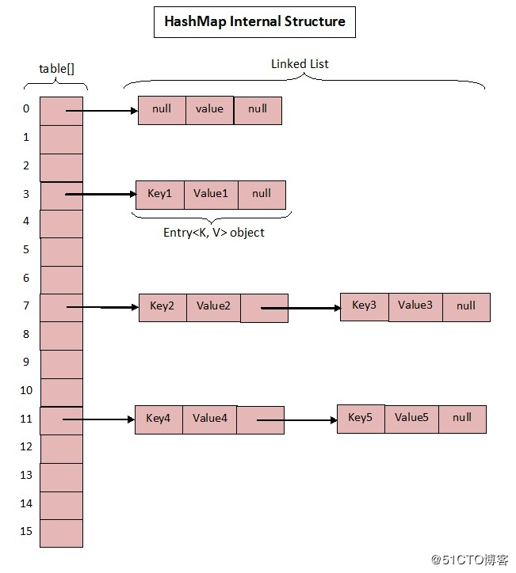
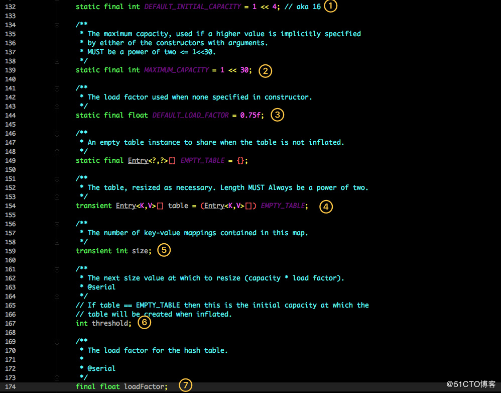
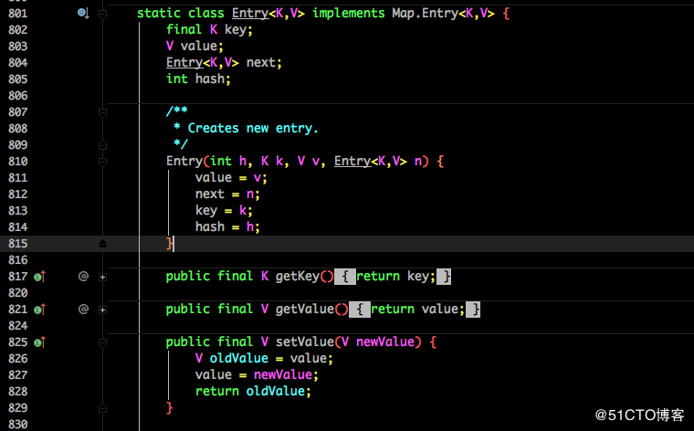

# 第09章 多线程并发详解

## 9.1 死锁

### 死锁的概念

两个或两个以上的线程在执行过程中因为争夺资源造成的一种互相等待的现象

### 死锁发生的条件

+ 1.互斥条件
  > 在某一段时间，只能由一个线程占用，如果此时有其他的线程请求，那么请求者只能等待。直到资源释放
+ 2.请求和保持条件
  > 已经占有至少一个资源，有提出请求其他资源，该资源已经被其他线程占用，请求进程阻塞，但又对已获得的线程不放
+ 3.不剥夺条件 
  > 已经占有的资源不会被剥夺，只能自己释放
+ 4.环路等待条件
  > 发生死锁的时候，一定存在一个进程，他是一个死锁的环形链
  
### 死锁的示例代码

```java
/***********************************************************
 * @Description : 线程死锁示例
 * @author      : 梁山广(Liang Shan Guang)
 * @date        : 2019/9/4 23:16
 * @email       : liangshanguang2@gmail.com
 ***********************************************************/
package com.huawei.l00379880.mythread.Chapter09ThreadExtend;

import lombok.extern.slf4j.Slf4j;

/**
 * 一个简单的死锁类
 * 当DeadLock类的对象flag==1时（td1），先锁定o1,睡眠500毫秒
 * 而td1在睡眠的时候另一个flag==0的对象（td2）线程启动（因为两个线程锁地不是一个对象），先锁定o2,睡眠500毫秒
 * td1睡眠结束后需要锁定o2才能继续执行，而此时o2已被td2锁定；
 * td2睡眠结束后需要锁定o1才能继续执行，而此时o1已被td1锁定；
 * td1、td2相互等待，都需要得到对方锁定的资源才能继续执行，从而死锁。
 */

@Slf4j
public class DeadLock implements Runnable {
    public int flag = 1;
    /**
     * 静态对象是类的所有对象共享的
     */
    private static Object o1 = new Object(), o2 = new Object();

    @Override
    public void run() {
        log.info("flag:{}", flag);
        if (flag == 1) {
            synchronized (o1) {
                try {
                    Thread.sleep(500);
                } catch (Exception e) {
                    e.printStackTrace();
                }
                synchronized (o2) {
                    log.info("1");
                }
            }
        }
        if (flag == 0) {
            synchronized (o2) {
                try {
                    Thread.sleep(500);
                } catch (Exception e) {
                    e.printStackTrace();
                }
                synchronized (o1) {
                    log.info("0");
                }
            }
        }
    }

    public static void main(String[] args) {
        DeadLock td1 = new DeadLock();
        DeadLock td2 = new DeadLock();
        td1.flag = 1;
        td2.flag = 0;
        //td1,td2都处于可执行状态，但JVM线程调度先执行哪个线程是不确定的。
        //td2的run()可能在td1的run()之前运行
        new Thread(td1).start();
        new Thread(td2).start();
    }
}
```

### 死锁的避免与解决

+ 死锁的避免
  + 1.注意锁的顺序
  + 2.注意加锁时间
  + 3.死锁检测
+ 死锁的解决
  + 1.释放所有锁
  + 2.设置优先级

## 9.2 并发最佳实践

+ 1.尽量使用本地变量
+ 2.尽量使用不可变类
+ 3.最小化锁的作用域范围：S=1/(1-a+a/n)
+ 4.尽量使用线程池而不是去new Thread
+ 5.宁可使用同步(CountDownLatch、Semaphore、CyclicBarrier)，也不要使用wait和notify
+ 6.使用BlockingQueue实现生产-消费模式
+ 7.使用`并发集合(CopyOnwriteXXX、ConcurrentHashMap等)`而不是`加了锁的同步集合(Collections.synchronizedXXX)`
+ 8.使用Semaphore创建有界的访问
+ 9.宁可使用同步代码块，也不使用同步的方法
+ 10.避免使用静态变量

## 9.3 Spring与线程安全

## 9.4 HaspMap与ConcurrentHashMap

参考文章[HashMap? ConcurrentHashMap? 相信看完这篇没人能难住你！](https://blog.51cto.com/zero01/2307070)

Map 这样的 Key Value 在软件开发中是非常经典的结构，常用于在内存中存放数据。

本篇主要想讨论 ConcurrentHashMap 这样一个并发容器，在正式开始之前我觉得有必要谈谈 HashMap，没有它就不会有后面的 ConcurrentHashMap。

### JDK1.7中的HashMap

众所周知 HashMap 底层是基于 数组 + 链表 组成的，不过在 jdk1.7 和 1.8 中具体实现稍有不同。在 1.7 中HashMap的数据结构图如下：



我们先来看看1.7中HashMap的实现，源码如下：



这是 HashMap 中比较核心的几个成员变量；看看分别是什么意思？

初始化桶大小，因为底层是数组，所以这是数组默认的大小。

+ 1.桶最大值。
+ 2.默认的负载因子（0.75）
+ 3.table 真正存放数据的数组。
+ 4.Map 存放数量的大小。
+ 5.桶大小，可在初始化时显式指定。
+ 6.负载因子，可在初始化时显式指定。

这里重点解释一下负载因子，HashMap中共有四个构造函数，我们来看一下HashMap中较为重要的两个构造函数，源码如下：

```java
public HashMap() {
    this(DEFAULT_INITIAL_CAPACITY, DEFAULT_LOAD_FACTOR);
}

public HashMap(int initialCapacity, float loadFactor) {
    if (initialCapacity < 0)
        throw new IllegalArgumentException("Illegal initial capacity: " + initialCapacity);
    if (initialCapacity > MAXIMUM_CAPACITY)
        initialCapacity = MAXIMUM_CAPACITY;
    if (loadFactor <= 0 || Float.isNaN(loadFactor))
        throw new IllegalArgumentException("Illegal load factor: " + loadFactor);

    this.loadFactor = loadFactor;
    threshold = initialCapacity;
    init();
}
```

由于给定的 HashMap 的容量大小是固定的，而从源码中可以看到默认初始化时给定的默认容量为 16，负载因子为 0.75。Map 在使用过程中不断的往里面存放数据，当数量达到了 16 * 0.75 = 12 就需要将当前 16 的容量进行扩容，而扩容这个过程涉及到 rehash、复制数据等操作，所以非常消耗性能。

因此通常建议能`提前预估HashMap的大小最好`，尽量的减少扩容带来的性能损耗。根据代码可以看到其实真正存放数据的数组是：

```java
transient Entry<K,V>[] table = (Entry<K,V>[]) EMPTY_TABLE;
```

那么这个数组，它又是如何定义的呢？如下：



Entry 是 HashMap 中的一个内部类，从他的成员变量很容易看出：

+ key就是写入时的键。
+ value自然就是值。
+ 开始的时候就提到 HashMap 是由数组和链表组成，所以这个 next 就是用于实现链表结构。
+ hash存放的是当前 key 的 hashcode

知晓了基本结构后，那我们来看看其中最为重要的写入以及获取函数。

### 1.put方法

```java
public V put(K key, V value) {
    if (table == EMPTY_TABLE) {
        inflateTable(threshold);
    }
    if (key == null)
        return putForNullKey(value);
    int hash = hash(key);
    int i = indexFor(hash, table.length);
    for (Entry<K,V> e = table[i]; e != null; e = e.next) {
        Object k;
        if (e.hash == hash && ((k = e.key) == key || key.equals(k))) {
            V oldValue = e.value;
            e.value = value;
            e.recordAccess(this);
            return oldValue;
        }
    }
    modCount++;
    addEntry(hash, key, value, i);
    return null;
}    
```

源码说明：

+ 判断当前数组是否需要初始化。
+ 如果 key 为空，则 put 一个空值进去。
+ 根据 key 计算出 hashcode。
+ 根据计算出的 hashcode 定位出所在桶。
+ 如果桶是一个链表则需要遍历判断里面的 hashcode、key 是否和传入 key 相等，如果相等则进行覆盖，并返回原来的值。
+ 如果桶是空的，说明当前位置没有数据存入；新增一个 Entry 对象写入当前位置。

### 2、addEntry与createEntry方法

```java
void addEntry(int hash, K key, V value, int bucketIndex) {
    if ((size >= threshold) && (null != table[bucketIndex])) {
        resize(2 * table.length);
        hash = (null != key) ? hash(key) : 0;
        bucketIndex = indexFor(hash, table.length);
    }
    createEntry(hash, key, value, bucketIndex);
}

void createEntry(int hash, K key, V value, int bucketIndex) {
    Entry<K,V> e = table[bucketIndex];
    table[bucketIndex] = new Entry<>(hash, key, value, e);
    size++;
}    
```

源码说明：

+ 当调用 addEntry 写入 Entry 时需要判断是否需要扩容。
+ 如果需要就进行两倍扩充，并将当前的 key 重新 hash 并定位。
+ 而在 createEntry 中会将当前位置的桶传入到新建的桶中，如果当前桶有值就会在位置形成链表。

### 3、get方法

再来看看 get 方法，以及该方法内调用的 getEntry 方法：

```java
public V get(Object key) {
    if (key == null)
        return getForNullKey();
    Entry<K,V> entry = getEntry(key);
    return null == entry ? null : entry.getValue();
}

final Entry<K,V> getEntry(Object key) {
    if (size == 0) {
        return null;
    }

    int hash = (key == null) ? 0 : hash(key);
    for (Entry<K,V> e = table[indexFor(hash, table.length)]; e != null; e = e.next) {
        Object k;
        if (e.hash == hash && ((k = e.key) == key || (key != null && key.equals(k))))
            return e;
    }   
    return null;
}    
```

源码说明：

+ 首先也是根据key计算出hashcode，然后定位到具体的桶中。
+ 判断该位置是否为链表
+ 不是链表就根据key、key的hashcode是否相等来返回值。
+ 为链表则需要遍历直到key及hashcode 相等时候就返回值。
+ 啥都没取到就直接返回 null 。