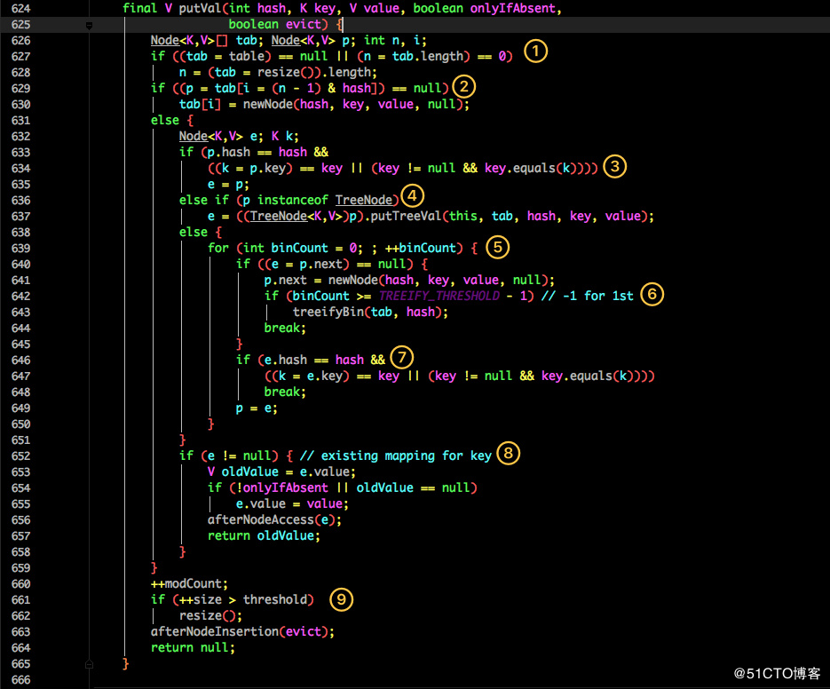
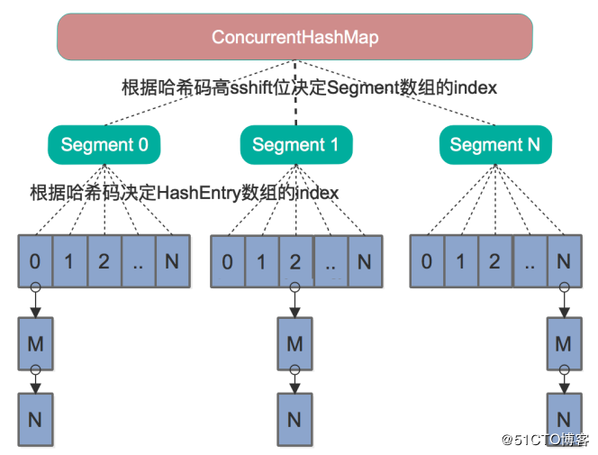
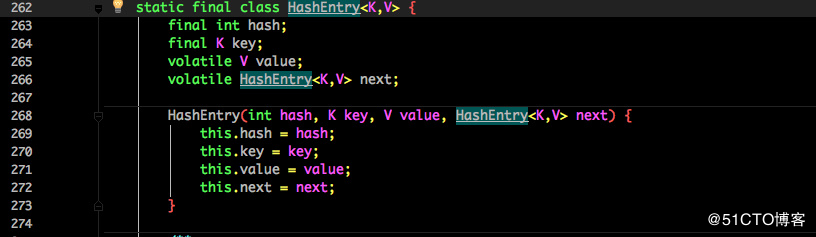
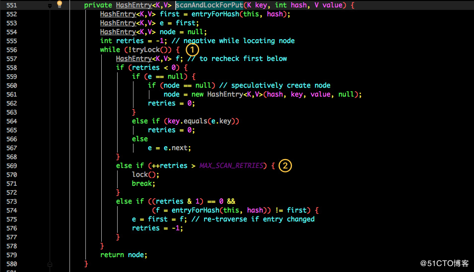
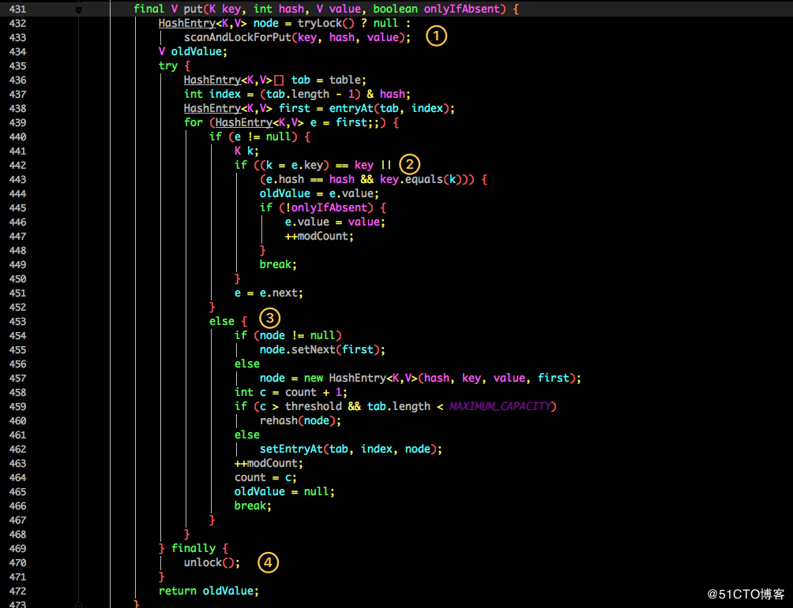
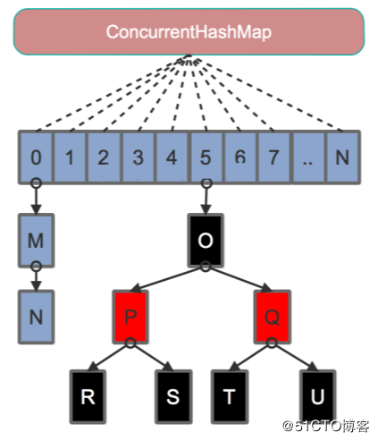
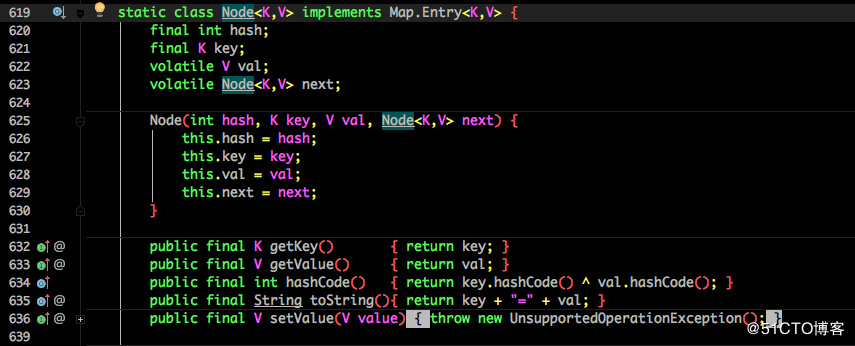
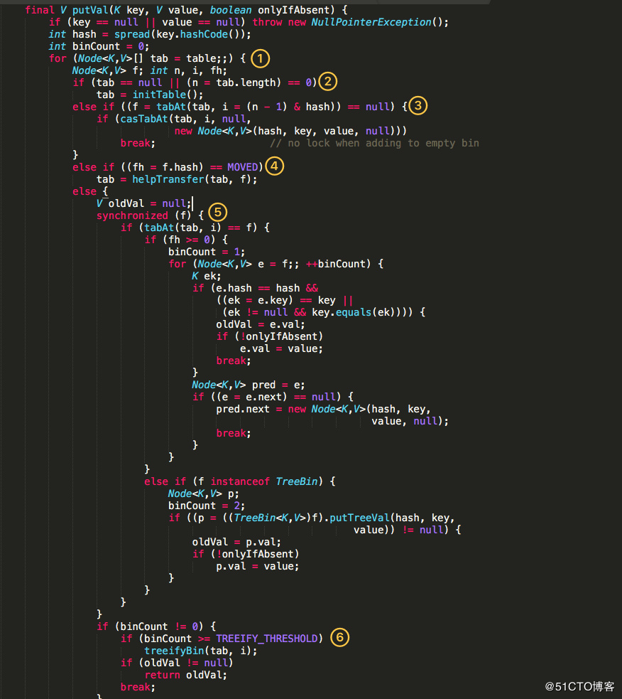
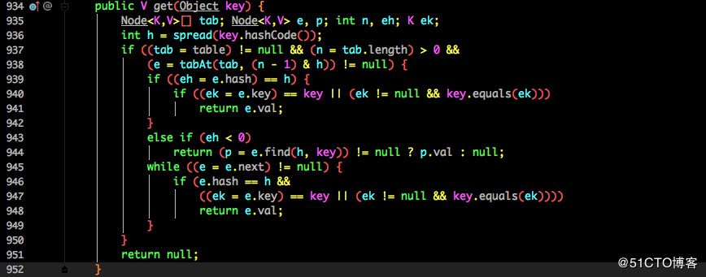

# 9.4 HaspMap与ConcurrentHashMap

参考文章[HashMap? ConcurrentHashMap? 相信看完这篇没人能难住你！](https://blog.51cto.com/zero01/2307070)

Map 这样的 Key Value 在软件开发中是非常经典的结构，常用于在内存中存放数据。

本篇主要想讨论 ConcurrentHashMap 这样一个并发容器，在正式开始之前我觉得有必要谈谈 HashMap，没有它就不会有后面的 ConcurrentHashMap。

## JDK1.7中的HashMap

众所周知 HashMap 底层是基于 数组 + 链表 组成的，不过在 jdk1.7 和 1.8 中具体实现稍有不同。在 1.7 中HashMap的数据结构图如下：


我们先来看看1.7中HashMap的实现，源码如下：


这是 HashMap 中比较核心的几个成员变量；看看分别是什么意思？

初始化桶大小，因为底层是数组，所以这是数组默认的大小。

+ 1.桶最大值。
+ 2.默认的负载因子（0.75）
+ 3.table 真正存放数据的数组。
+ 4.Map 存放数量的大小。
+ 5.桶大小，可在初始化时显式指定。
+ 6.负载因子，可在初始化时显式指定。

这里重点解释一下负载因子，HashMap中共有四个构造函数，我们来看一下HashMap中较为重要的两个构造函数，源码如下：

```java
public HashMap() {
    this(DEFAULT_INITIAL_CAPACITY, DEFAULT_LOAD_FACTOR);
}

public HashMap(int initialCapacity, float loadFactor) {
    if (initialCapacity < 0)
        throw new IllegalArgumentException("Illegal initial capacity: " + initialCapacity);
    if (initialCapacity > MAXIMUM_CAPACITY)
        initialCapacity = MAXIMUM_CAPACITY;
    if (loadFactor <= 0 || Float.isNaN(loadFactor))
        throw new IllegalArgumentException("Illegal load factor: " + loadFactor);

    this.loadFactor = loadFactor;
    threshold = initialCapacity;
    init();
}
```

由于给定的 HashMap 的容量大小是固定的，而从源码中可以看到默认初始化时给定的默认容量为 16，负载因子为 0.75。Map 在使用过程中不断的往里面存放数据，当数量达到了 16 * 0.75 = 12 就需要将当前 16 的容量进行扩容，而扩容这个过程涉及到 rehash、复制数据等操作，所以非常消耗性能。

因此通常建议能`提前预估HashMap的大小最好`，尽量的减少扩容带来的性能损耗。根据代码可以看到其实真正存放数据的数组是：

```java
transient Entry<K,V>[] table = (Entry<K,V>[]) EMPTY_TABLE;
```

那么这个数组，它又是如何定义的呢？如下：


Entry 是 HashMap 中的一个内部类，从他的成员变量很容易看出：

+ key就是写入时的键。
+ value自然就是值。
+ 开始的时候就提到 HashMap 是由数组和链表组成，所以这个 next 就是用于实现链表结构。
+ hash存放的是当前 key 的 hashcode

知晓了基本结构后，那我们来看看其中最为重要的写入以及获取函数。

### 1.put方法

```java
public V put(K key, V value) {
    if (table == EMPTY_TABLE) {
        inflateTable(threshold);
    }
    if (key == null)
        return putForNullKey(value);
    int hash = hash(key);
    int i = indexFor(hash, table.length);
    for (Entry<K,V> e = table[i]; e != null; e = e.next) {
        Object k;
        if (e.hash == hash && ((k = e.key) == key || key.equals(k))) {
            V oldValue = e.value;
            e.value = value;
            e.recordAccess(this);
            return oldValue;
        }
    }
    modCount++;
    addEntry(hash, key, value, i);
    return null;
}    
```

源码说明：

+ 判断当前数组是否需要初始化。
+ 如果 key 为空，则 put 一个空值进去。
+ 根据 key 计算出 hashcode。
+ 根据计算出的 hashcode 定位出所在桶。
+ 如果桶是一个链表则需要遍历判断里面的 hashcode、key 是否和传入 key 相等，如果相等则进行覆盖，并返回原来的值。
+ 如果桶是空的，说明当前位置没有数据存入；新增一个 Entry 对象写入当前位置。

### 2、addEntry与createEntry方法

```java
void addEntry(int hash, K key, V value, int bucketIndex) {
    if ((size >= threshold) && (null != table[bucketIndex])) {
        resize(2 * table.length);
        hash = (null != key) ? hash(key) : 0;
        bucketIndex = indexFor(hash, table.length);
    }
    createEntry(hash, key, value, bucketIndex);
}

void createEntry(int hash, K key, V value, int bucketIndex) {
    Entry<K,V> e = table[bucketIndex];
    table[bucketIndex] = new Entry<>(hash, key, value, e);
    size++;
}    
```

源码说明：

+ 当调用 addEntry 写入 Entry 时需要判断是否需要扩容。
+ 如果需要就进行两倍扩充，并将当前的 key 重新 hash 并定位。
+ 而在 createEntry 中会将当前位置的桶传入到新建的桶中，如果当前桶有值就会在位置形成链表。

### 3、get方法

再来看看 get 方法，以及该方法内调用的 getEntry 方法：

```java
public V get(Object key) {
    if (key == null)
        return getForNullKey();
    Entry<K,V> entry = getEntry(key);
    return null == entry ? null : entry.getValue();
}

final Entry<K,V> getEntry(Object key) {
    if (size == 0) {
        return null;
    }

    int hash = (key == null) ? 0 : hash(key);
    for (Entry<K,V> e = table[indexFor(hash, table.length)]; e != null; e = e.next) {
        Object k;
        if (e.hash == hash && ((k = e.key) == key || (key != null && key.equals(k))))
            return e;
    }   
    return null;
}    
```

源码说明：

+ 首先也是根据key计算出hashcode，然后定位到具体的桶中
+ 判断该位置是否为链表
+ 不是链表就根据key、key的hashcode是否相等来返回值
+ 为链表则需要遍历直到key及hashcode 相等时候就返回值
+ 啥都没取到就直接返回null

## JDK1.8中的HashMap

不知道从 1.7 的实现大家看出需要优化的点没有？其实一个很明显需要优化的地方就是：

> 当 Hash 冲突严重时，在桶上形成的链表会变的越来越长，这样在查询时的效率就会越来越低；时间复杂度为 O(N)


我们先来看看在1.8中HashMap几个核心的成员变量：

```java
/**
 * The default initial capacity - MUST be a power of two.
 */
static final int DEFAULT_INITIAL_CAPACITY = 1 << 4; // aka 16

/**
 * The maximum capacity, used if a higher value is implicitly specified
 * by either of the constructors with arguments.
 * MUST be a power of two <= 1<<30.
 */
static final int MAXIMUM_CAPACITY = 1 << 30;

/**
 * The load factor used when none specified in constructor.
 */
static final float DEFAULT_LOAD_FACTOR = 0.75f;

/**
 * The bin count threshold for using a tree rather than list for a
 * bin.  Bins are converted to trees when adding an element to a
 * bin with at least this many nodes. The value must be greater
 * than 2 and should be at least 8 to mesh with assumptions in
 * tree removal about conversion back to plain bins upon
 * shrinkage.
 */
static final int TREEIFY_THRESHOLD = 8;

/**
 * The table, initialized on first use, and resized as
 * necessary. When allocated, length is always a power of two.
 * (We also tolerate length zero in some operations to allow
 * bootstrapping mechanics that are currently not needed.)
 */
transient Node<K,V>[] table;

/**
 * Holds cached entrySet(). Note that AbstractMap fields are used
 * for keySet() and values().
 */
transient Set<Map.Entry<K,V>> entrySet;

/**
 * The number of key-value mappings contained in this map.
 */
transient int size;
```

可以看到，和 1.7 大体上都差不多，还是有几个重要的区别：

+ TREEIFY_THRESHOLD用于判断是否需要将链表转换为红黑树的阈值
+ HashEntry修改为Node

Node 的核心组成其实也是和 1.7 中的 HashEntry 一样，存放的都是 key value hashcode next 等数据

`然后我们再来看看核心方法。`

### 1.put方法(put里调用的是putVal)



看似要比 1.7 的复杂，我们一步步进行拆解：

+ 判断当前桶是否为空，空的就需要初始化（resize 中会判断是否进行初始化）。
+ 根据当前 key 的 hashcode 定位到具体的桶中并判断是否为空，为空表明没有 Hash 冲突就直接在当前位置创建一个新桶即可。
+ 如果当前桶有值（ Hash 冲突），那么就要比较当前桶中的 key、key 的 hashcode 与写入的 key 是否相等，相等就赋值给 e,在第 8 步的时候会统一进行赋值及返回。
+ 如果当前桶为红黑树，那就要按照红黑树的方式写入数据。
+ 如果是个链表，就需要将当前的 key、value 封装成一个新节点写入到当前桶的后面（形成链表）。
+ 接着判断当前链表的大小是否大于预设的阈值，大于时就要转换为红黑树。
+ 如果在遍历过程中找到 key 相同时直接退出遍历。
+ 如果 e != null 就相当于存在相同的 key,那就需要将值覆盖。
+ 最后判断是否需要进行扩容

### 2.get 方法(get里调用的是getNode)

```java
public V get(Object key) {
    Node<K,V> e;
    return (e = getNode(hash(key), key)) == null ? null : e.value;
}

final Node<K,V> getNode(int hash, Object key) {
    Node<K,V>[] tab; Node<K,V> first, e; int n; K k;
    if ((tab = table) != null && (n = tab.length) > 0 &&
        (first = tab[(n - 1) & hash]) != null) {
        if (first.hash == hash && // always check first node
            ((k = first.key) == key || (key != null && key.equals(k))))
            return first;
        if ((e = first.next) != null) {
            if (first instanceof TreeNode)
                return ((TreeNode<K,V>)first).getTreeNode(hash, key);
            do {
                if (e.hash == hash &&
                    ((k = e.key) == key || (key != null && key.equals(k))))
                    return e;
            } while ((e = e.next) != null);
        }
    }
    return null;
}
```
get 方法看起来就要简单许多了：

+ 首先将 key hash 之后取得所定位的桶
+ 如果桶为空则直接返回 null 。
+ 否则判断桶的第一个位置(有可能是链表、红黑树)的 key 是否为查询的 key，是就直接返回 value。
+ 如果第一个不匹配，则判断它的下一个是红黑树还是链表。
+ 红黑树就按照树的查找方式返回值。
+ 不然就按照链表的方式遍历匹配返回值

从这两个核心方法(get/put)可以看出 1.8 中对大链表做了优化，`修改为红黑树之后查询效率直接提高到了O(logn)`

## HashMap存在的问题

但是 HashMap 原有的问题也都存在，比如在并发场景下使用时容易出现死循环，如下示例：

```java
final HashMap<String, String> map = new HashMap<String, String>();
for (int i = 0; i < 1000; i++) {
    new Thread(new Runnable() {
        @Override
        public void run() {
            map.put(UUID.randomUUID().toString(), "");
        }
    }).start();
}
```

但是为什么呢？我们来简单分析一下。上文中提到`在HashMap扩容的时候会调用resize()方法，就是这里的并发操作容易在一个桶上形成环形链表`；这样当获取一个不存在的 key 时，计算出的 index 正好是环形链表的下标就会出现死循环。

我们先来看单线程下的rehash过程，如下图：


多线程并发下的rehash过程，如下图：


## HashMap的遍历方式

> 还有一个值得注意的是 HashMap 的遍历方式，通常有以下几种：

```java
public static void main(String[] args) {
    Map<String, Integer> map = new HashMap<>();
    map.put("a", 1);
    map.put("b", 2);

    Iterator<Map.Entry<String, Integer>> entryIterator = map.entrySet().iterator();
    while (entryIterator.hasNext()) {
        Map.Entry<String, Integer> next = entryIterator.next();
        System.out.println("key=" + next.getKey() + " value=" + next.getValue());
    }

    Iterator<String> iterator = map.keySet().iterator();
    while (iterator.hasNext()) {
        String key = iterator.next();
        System.out.println("key=" + key + " value=" + map.get(key));
    }

    // 等同于第一种方式
    for (Map.Entry<String, Integer> entry : map.entrySet()) {
        System.out.println("key=" + entry.getKey() + " value=" + entry.getValue());
    }
}
```

强烈建议使用 EntrySet 进行遍历。第一种和第三种遍历方式都可以把 key value 同时取出，而第二种还得需要通过 key 取一次 value，效率较低。

## 简单总结下HashMap

无论是 1.7 还是 1.8 其实都能看出 JDK 没有对它做任何的同步操作，所以并发会出问题，甚至出现死循环导致系统不可用。

因此 JDK 推出了专项专用的 ConcurrentHashMap ，该类位于 java.util.concurrent 包下，专门用于解决并发问题。坚持看到这里的朋友算是已经把 ConcurrentHashMap 的基础已经打牢了，下面正式开始分析。

## JDK1.7中的ConcurrentHashMap

ConcurrentHashMap同样也分为1.7、1.8版, 所以两者在实现上略有不同。同样的，我们先来看看 1.7 的实现，下面是它的结构图：



如图所示，是由 Segment 数组、HashEntry 组成，和 HashMap 一样，仍然是数组加链表。

它的核心成员变量：

```java
/**
 * Segment 数组，存放数据时首先需要定位到具体的 Segment 中。
 */
final Segment<K,V>[] segments;
transient Set<K> keySet;
transient Set<Map.Entry<K,V>> entrySet;
```

其中Segment 是 ConcurrentHashMap 的一个内部类，主要的组成如下：

```java
static final class Segment<K,V> extends ReentrantLock implements Serializable {
    private static final long serialVersionUID = 2249069246763182397L;
    // 和 HashMap 中的 HashEntry 作用一样，真正存放数据的桶
    transient volatile HashEntry<K,V>[] table;
    transient int count;
    transient int modCount;
    transient int threshold;
    final float loadFactor;
}
```

看看其中 HashEntry 的组成：



和HashMap非常类似，唯一的区别就是其中的核心数据如 value ，以及链表都是 volatile 修饰的，保证了获取时的可见性。

### 原理上来说：

ConcurrentHashMap 采用了分段锁技术，其中 Segment 继承于 ReentrantLock。不会像 HashTable 那样不管是 put 还是 get 操作都需要做同步处理，理论上 ConcurrentHashMap 支持 CurrencyLevel (Segment 数组数量)的线程并发。每当一个线程占用锁访问一个 Segment 时，不会影响到其他的 Segment。

`下面也来看看核心的put和get方法`：

### put 方法：

```java
public V put(K key, V value) {
    Segment<K,V> s;
    if (value == null)
        throw new NullPointerException();
    int hash = hash(key);
    int j = (hash >>> segmentShift) & segmentMask;
    if ((s = (Segment<K,V>)UNSAFE.getObject          // nonvolatile; recheck
         (segments, (j << SSHIFT) + SBASE)) == null) //  in ensureSegment
        s = ensureSegment(j);
    return s.put(key, hash, value, false);
}
```

首先是通过 key 定位到 Segment，之后在对应的 Segment 中进行具体的 put：

```java
final V put(K key, int hash, V value, boolean onlyIfAbsent) {
    HashEntry<K,V> node = tryLock() ? null :
        scanAndLockForPut(key, hash, value);
    V oldValue;
    try {
        HashEntry<K,V>[] tab = table;
        int index = (tab.length - 1) & hash;
        HashEntry<K,V> first = entryAt(tab, index);
        for (HashEntry<K,V> e = first;;) {
            if (e != null) {
                K k;
                if ((k = e.key) == key ||
                    (e.hash == hash && key.equals(k))) {
                    oldValue = e.value;
                    if (!onlyIfAbsent) {
                        e.value = value;
                        ++modCount;
                    }
                    break;
                }
                e = e.next;
            }
            else {
                if (node != null)
                    node.setNext(first);
                else
                    node = new HashEntry<K,V>(hash, key, value, first);
                int c = count + 1;
                if (c > threshold && tab.length < MAXIMUM_CAPACITY)
                    rehash(node);
                else
                    setEntryAt(tab, index, node);
                ++modCount;
                count = c;
                oldValue = null;
                break;
            }
        }
    } finally {
        unlock();
    }
    return oldValue;
}
```

虽然 HashEntry 中的 value 是用 volatile 关键词修饰的，但是并不能保证并发的原子性，所以 put 操作时仍然需要加锁处理。

首先第一步的时候会尝试获取锁，如果获取失败肯定就有其他线程存在竞争，则利用 scanAndLockForPut() 自旋获取锁。



源码说明：

+ 1.尝试自旋获取锁
+ 2.如果重试的次数达到了 MAX_SCAN_RETRIES 则改为阻塞锁获取，保证能获取成功



再结合图看看 put 的流程：

+ 1.将当前 Segment 中的 table 通过 key 的 hashcode 定位到 HashEntry。
+ 2.遍历该 HashEntry，如果不为空则判断传入的 key 和当前遍历的 key 是否相等，相等则覆盖旧的 value。
+ 3.不为空则需要新建一个 HashEntry 并加入到 Segment 中，同时会先判断是否需要扩容。
+ 4.最后会解除在 1 中所获取当前 Segment 的锁。

### get方法

```java
public V get(Object key) {
    Segment<K,V> s; // manually integrate access methods to reduce overhead
    HashEntry<K,V>[] tab;
    int h = hash(key);
    long u = (((h >>> segmentShift) & segmentMask) << SSHIFT) + SBASE;
    if ((s = (Segment<K,V>)UNSAFE.getObjectVolatile(segments, u)) != null &&
        (tab = s.table) != null) {
        for (HashEntry<K,V> e = (HashEntry<K,V>) UNSAFE.getObjectVolatile
                 (tab, ((long)(((tab.length - 1) & h)) << TSHIFT) + TBASE);
             e != null; e = e.next) {
            K k;
            if ((k = e.key) == key || (e.hash == h && key.equals(k)))
                return e.value;
        }
    }
    return null;
}
```

get 逻辑比较简单：

+ 只需要将 Key 通过 Hash 之后定位到具体的 Segment ，再通过一次Hash 定位到具体的元素上
+ 由于 HashEntry 中的 value 属性是用 volatile 关键词修饰的，保证了内存可见性，所以每次获取时都是最新值
+ ConcurrentHashMap 的 get 方法是非常高效的，因为整个过程都不需要加锁

## JDK1.8中的ConcurrentHashMap

### 原理

1.7 已经解决了并发问题，并且能支持 N 个 Segment 这么多次数的并发，但依然存在 HashMap在1.7版本中的问题。那就是`查询遍历链表效率太低`。因此 1.8 做了一些数据结构上的调整。

首先来看下底层的组成结构：



看起来是不是和 1.8 HashMap 结构类似？其中抛弃了原有的 Segment 分段锁，而采用了 CAS + synchronized 来保证并发安全性：



也将 1.7 中存放数据的 HashEntry 改为 Node，但作用都是相同的。其中的 val next 都用了 volatile 修饰，保证了可见性。

### put方法



源码说明：

+ 1.根据 key 计算出 hashcode
+ 2.判断是否需要进行初始化。
+ 3.f即为当前 key 定位出的 Node，如果为空表示当前位置可以写入数据，利用 CAS 尝试写入，失败则自旋保证成功。
+ 4.如果当前位置的 hashcode == MOVED == -1,则需要进行扩容。
+ 5.如果都不满足，则利用 synchronized 锁写入数据。
+ 6.如果数量大于 TREEIFY_THRESHOLD 则要转换为红黑树。

### get 方法：



源码说明：

+ 根据计算出来的 hashcode 寻址，如果就在桶上那么直接返回值
+ 如果是红黑树那就按照树的方式获取值
+ 就不满足那就按照链表的方式遍历获取值

1.8在1.7的数据结构上做了大的改动，采用红黑树之后可以保证查询效率(O(logn))，甚至取消了 ReentrantLock 改为了 synchronized，这样可以看出在新版的JDK中对synchronized优化是很到位的

## HashMap和ConcurrentHashMap总结以及面试问题

看完了整个 HashMap 和 ConcurrentHashMap 在JDK 1.7 和 1.8 中不同的实现方式相信大家对他们的理解应该会更加到位。其实这块也是面试的重点内容，通常的套路是：

+ 1.谈谈你理解的HashMap，讲讲其中的get/put过程
+ 2.1.8 中对HashMap做了什么优化？
+ 3.HashMap是线程安全的嘛？
+ 4.不安全会导致哪些问题？
+ 5.如何解决？有没有线程安全的并发容器？
+ 6.ConcurrentHashMap 是如何实现的？ 1.7、1.8 实现有何不同？为什么这么做？

这一串问题相信大家仔细看完都能怼回面试官。除了面试会问到之外平时的应用其实也蛮多，像之前谈到的 Guava 中 Cache 的实现就是利用 ConcurrentHashMap 的思想。同时也能学习 JDK 作者大牛们的优化思路以及并发解决方案

