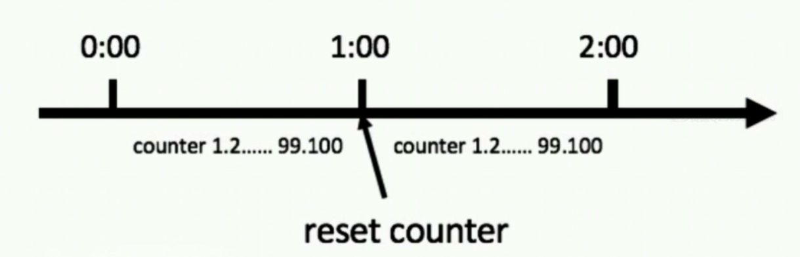
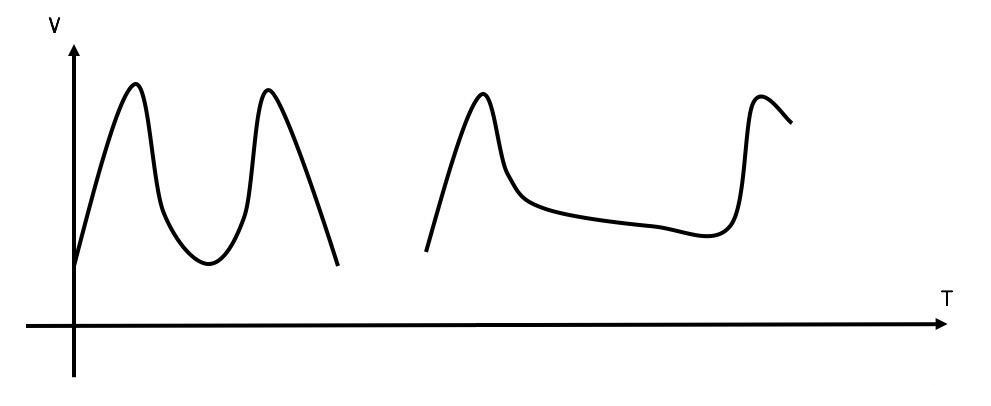

# 第14章 高并发之应用限流思路

在开发高并发系统时，有三把利器用来保护系统：缓存、降级和限流：
缓存：缓存的目的是提升系统访问速度和增大系统处理容量
降级：降级是当服务出现问题或者影响到核心流程时，需要暂时屏蔽掉，待高峰或者问题解决后再打开
限流：限流的目的是通过对并发访问/请求进行限速，或者对一个时间窗口内的请求进行限速来保护系统，一旦达到限制速率则可以拒绝服务、排队或等待、降级等处理

本文仅针对限流做一些简单的说明，那么何为限流呢？顾名思义，限流就是限制流量，就像你宽带包了1个G的流量，用完了就没了。通过限流，我们可以很好地控制系统的qps，从而达到保护系统的目的。本篇文章将会介绍一下常用的限流算法以及他们各自的特点。

限流本质上是控制某段代码在一定时间内执行的次数，例如我们系统每天五点过后都有130w~140w的数据需要插入数据库，若是直接一次性插入这些数据，必将导致数据库连接被占满无法接收其他处理的请求，数据库的负载压力会瞬间飙升，甚至是压垮数据库造成雪崩现象。所以我们需要对此操作进行限流，以一个恒定的速率去插入数据，假设每秒插入400条数据，当然这个数值需要根据实际情况去设定，如此一来就可以有效控制同一时间往数据库插入的数据流不会很大，这样就不会出现上述问题了。如下图：


## 应用限流的常用算法

+ 计数器法
+ 滑动窗口
+ 漏桶算法
+ 令牌桶算法

## 计数器法

计数器法是限流算法里最简单也是最容易实现的一种算法。比如我们规定，对于A接口来说，我们1分钟的访问次数不能超过100个。那么我们可以这么做：在一开始的时候，我们可以设置一个计数器counter，每当一个请求过来的时候，counter就加1，如果counter的值大于100并且该请求与第一个 请求的间隔时间还在1分钟之内，那么说明请求数过多；如果该请求与第一个请求的间隔时间大于1分钟，且counter的值还在限流范围内，那么就重置 counter，具体算法的示意图如下：



代码实现

```java
public class CounterDemo {
    public long timeStamp = getNowTime();  // 当前时间
    public int reqCount = 0;  // 初始化计数器
    public final int limit = 100; // 时间窗口内最大请求数
    public final long interval = 1000; // 时间窗口ms

    public boolean grant() {
        long now = getNowTime();
        if (now < timeStamp + interval) {
            // 在时间窗口内
            reqCount++;
            // 判断当前时间窗口内是否超过最大请求控制数
            return reqCount <= limit;
        } else {
            timeStamp = now;
            // 超时后重置
            reqCount = 1;
            return true;
        }
    }
}
```

这个算法虽然简单，但是有一个十分致命的问题，那就是临界问题，如下图：

![限流算法的临界问题][(https://img-blog.csdnimg.cn/20181123144625899.png)
从上图中我们可以看到，假设有一个恶意用户，他在0:59时，瞬间发送了100个请求，并且1:00又瞬间发送了100个请求，那么其实这个用户在 1秒里面，瞬间发送了200个请求。我们刚才规定的是1分钟最多100个请求，也就是每秒钟最多1.7个请求，用户通过在时间窗口的重置节点处突发请求， 可以瞬间超过我们的速率限制。用户有可能通过算法的这个漏洞，瞬间压垮我们的应用。

聪明的朋友可能已经看出来了，刚才的问题其实是因为我们统计的精度太低。那么如何很好地处理这个问题呢？或者说，如何将临界问题的影响降低呢？我们可以看下面的滑动窗口算法。

## 滑动窗口

滑动窗口，又称rolling window。为了解决计数器法统计精度太低的问题，引入了滑动窗口算法。如果学过TCP网络协议的话，那么一定对滑动窗口这个名词不会陌生。下面这张图，很好地解释了滑动窗口算法：


在上图中，整个红色的矩形框表示一个时间窗口，在我们的例子中，一个时间窗口就是一分钟。然后我们将时间窗口进行划分，比如图中，我们就将滑动窗口划成了6格，所以每格代表的是10秒钟。每过10秒钟，我们的时间窗口就会往右滑动一格。每一个格子都有自己独立的计数器counter，比如当一个请求 在0:35秒的时候到达，那么0:30~0:39对应的counter就会加1。

那么滑动窗口怎么解决刚才的临界问题的呢？在上图中，0:59到达的100个请求会落在灰色的格子中，而1:00到达的请求会落在橘×××的格子中。当时间到达1:00时，我们的窗口会往右移动一格，那么此时时间窗口内的总请求数量一共是200个，超过了限定的100个，所以此时能够检测出来触发了限流。

我再来回顾一下刚才的计数器算法，我们可以发现，计数器算法其实就是滑动窗口算法。只是它没有对时间窗口做进一步地划分，所以只有1格。

由此可见，当滑动窗口的格子划分的越多，那么滑动窗口的滚动就越平滑，限流的统计就会越精确。

## 漏桶算法

漏桶算法，又称leaky bucket。为了理解漏桶算法，我们看一下对于该算法的示意图：


从图中我们可以看到，整个算法其实十分简单。首先，我们有一个固定容量的桶，有水流进来，也有水流出去。对于流进来的水来说，我们无法预计一共有多少水会流进来，也无法预计水流的速度。但是对于流出去的水来说，这个桶可以固定水流出的速率。而且，当桶满了之后，多余的水将会溢出。

我们将算法中的水换成实际应用中的请求，我们可以看到漏桶算法天生就限制了请求的速度。当使用了漏桶算法，我们可以保证接口会以一个常速速率来处理请求。所以漏桶算法天生不会出现临界问题。

具体的伪代码如下：

```java
public class LeakyDemo {
        public long timeStamp = getNowTime();  // 当前时间
        public int capacity; // 桶的容量
        public int rate; // 水漏出的速度
        public int water; // 当前水量(当前累积请求数)

        public boolean grant() {
            long now = getNowTime();
            water = max(0, water - (now - timeStamp) * rate); // 先执行漏水，计算剩余水量
            timeStamp = now;
            if ((water + 1) < capacity) {
                // 尝试加水,并且水还未满
                water += 1;
                return true;
            } else {
                // 水满，拒绝加水
                return false;
        }
    }
}
```

## 令牌桶算法

令牌桶算法，又称token bucket。同样为了理解该算法，我们来看一下该算法的示意图：


从图中我们可以看到，令牌桶算法比漏桶算法稍显复杂。首先，我们有一个固定容量的桶，桶里存放着令牌（token）。桶一开始是空的，token以 一个固定的速率r往桶里填充，直到达到桶的容量，多余的令牌将会被丢弃。每当一个请求过来时，就会尝试从桶里移除一个令牌，如果没有令牌的话，请求无法通过。

具体的伪代码如下：

```java
public class TokenBucketDemo {
    public long timeStamp = getNowTime();  // 当前时间
    public int capacity; // 桶的容量
    public int rate; // 令牌放入速度
    public int tokens; // 当前令牌数量

    public boolean grant() {
        long now = getNowTime();
        // 先添加令牌
        tokens = min(capacity, tokens + (now - timeStamp) * rate);
        timeStamp = now;
        if (tokens < 1) {
            // 若不到1个令牌,则拒绝
            return false;
        } else {
            // 还有令牌，领取令牌
            tokens -= 1;
            return true;
        }
    }
}
```

若仔细研究算法，我们会发现我们默认从桶里移除令牌是不需要耗费时间的。如果给移除令牌设置一个延时时间，那么实际上又采用了漏桶算法的思路。Google的Guava库下的SmoothWarmingUp类就采用了这个思路。

我们再来考虑一下临界问题的场景。在0:59秒的时候，由于桶内积满了100个token，所以这100个请求可以瞬间通过。但是由于token是以较低的速率填充的，所以在1:00的时候，桶内的token数量不可能达到100个，那么此时不可能再有100个请求通过。所以令牌桶算法可以很好地解决临界问题。下图比较了计数器（左）和令牌桶算法（右）在临界点的速率变化。我们可以看到虽然令牌桶算法允许突发速率，但是下一个突发速率必须要等桶内有足够的 token后才能发生：



## 小结

### 计数器 VS 滑动窗口：

计数器算法是最简单的算法，可以看成是滑动窗口的低精度实现。滑动窗口由于需要存储多份的计数器（每一个格子存一份），所以滑动窗口在实现上需要更多的存储空间。也就是说，如果滑动窗口的精度越高，需要的存储空间就越大。

### 漏桶算法 VS 令牌桶算法：

漏桶算法和令牌桶算法最明显的区别是令牌桶算法允许流量一定程度的突发。因为默认的令牌桶算法，取走token是不需要耗费时间的，也就是说，假设桶内有100个token时，那么可以瞬间允许100个请求通过。

令牌桶算法由于实现简单，且允许某些流量的突发，对用户友好，所以被业界采用地较多。当然我们需要具体情况具体分析，只有最合适的算法，没有最优的算法。

## RateLimiter使用示例

Google开源工具包Guava提供了限流工具类RateLimiter，该类基于令牌桶算法(Token Bucket)来完成限流，非常易于使用。RateLimiter经常用于限制对一些物理资源或者逻辑资源的访问速率，它支持两种获取permits接口，一种是如果拿不到立刻返回false（tryAcquire()），一种会阻塞等待一段时间看能不能拿到（tryAcquire(long timeout, TimeUnit unit)）。

使用tryAcquire方法获取令牌的示例代码：

```java
@Slf4j
public class RateLimiterExample1 {
    /**
     * 每秒钟放入5个令牌，相当于每秒只允许执行5个请求
     */
    private static final RateLimiter RATE_LIMITER = RateLimiter.create(5);

    public static void main(String[] args) {
        // 模拟有100个请求
        for (int i = 0; i < 100; i++) {
            // 尝试从令牌桶中获取令牌，若获取不到则等待300毫秒看能不能获取到
            if (RATE_LIMITER.tryAcquire(300, TimeUnit.MILLISECONDS)) {
                // 获取成功，执行相应逻辑
                handle(i);
            }
        }
    }

    private static void handle(int i) {
        log.info("{}", i);
    }
}
```

若想保证所有的请求都被执行，而不会被抛弃的话，可以选择使用acquire方法：

```java
@Slf4j
public class RateLimiterExample2 {
    /**
     * 每秒钟放入5个令牌，相当于每秒只允许执行5个请求
     */
    private static final RateLimiter RATE_LIMITER = RateLimiter.create(5);

    public static void main(String[] args) {
        for (int i = 0; i < 100; i++) {
            // 从令牌桶中获取一个令牌，若没有获取到会阻塞直到获取到为止，所以所有的请求都会被执行
            RATE_LIMITER.acquire();
            // 获取成功，执行相应逻辑
            handle(i);
        }
    }

    private static void handle(int i) {
        log.info("{}", i);
    }
}
```

## 集群限流

前面讨论的几种算法都属于单机限流的范畴，但是业务需求五花八门，简单的单机限流，根本无法满足他们。

比如为了限制某个资源被每个用户或者商户的访问次数，5s只能访问2次，或者一天只能调用1000次，这种需求，单机限流是无法实现的，这时就需要通过集群限流进行实现。

如何实现？为了控制访问次数，肯定需要一个计数器，而且这个计数器只能保存在第三方服务，比如redis。

大概思路：每次有相关操作的时候，就向redis服务器发送一个incr命令，比如需要限制某个用户访问/index接口的次数，只需要拼接用户id和接口名生成redis的key，每次该用户访问此接口时，只需要对这个key执行incr命令，在这个key带上过期时间，就可以实现指定时间的访问频率。
